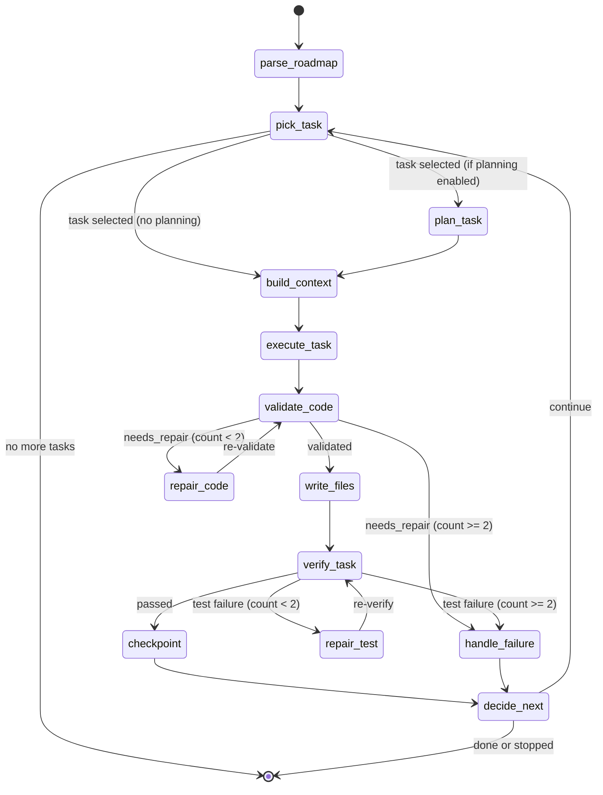
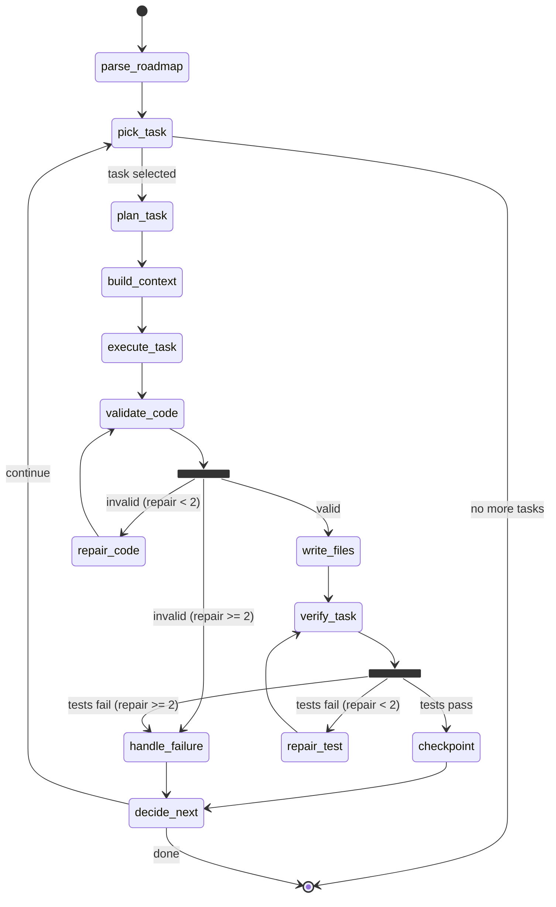
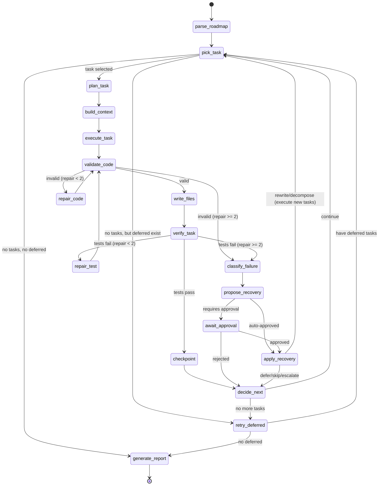

# Executor: Autonomous Development Agent

> **Goal**: Agent that reads tasks from ROADMAP.md and executes them autonomously
> **Status**: Active Development
> **Completed Phases**: See [EXECUTOR-COMPLETED.md](./EXECUTOR-COMPLETED.md)

---

## Current Status

**Completed**: Phases 0-5.13, Graph Migration, Feature Parity, Phase 1, Phase 2 (240+ recovery tests passing)
**In Progress**: Phase 3 (CLI Scenario Testing)
**Next**: Phase 4 (Production Hardening)
**Future**: Phase 5 (Enterprise Features)

---

## Design Philosophy: Model-Robust Execution

> **Core Principle**: Write code that WORKS with ANY model, not code that hopes the model gets it right.

The executor must perform excellently even with less capable models (gpt-5-mini, gpt-4.1-nano).
This requires **constraining the problem space** through engineering, not hoping for model intelligence.

### The Problem with Current Design

```
Current Flow (Wasteful):
┌──────────┐     ┌──────────┐     ┌──────────┐     ┌──────────┐
│ execute  │────▶│  write   │────▶│  verify  │────▶│ analyze  │
│ (LLM)    │     │ to disk  │     │ (pytest) │     │ failure  │
└──────────┘     └──────────┘     └──────────┘     └──────────┘
                      │                                  │
                      │         Syntax Error!            │
                      │◄─────────────────────────────────┘
                      │         (wasted retry cycle)
```

**Problems**:
1. LLM generates code with syntax error (e.g., `""""` instead of `"""`)
2. Code is written to disk
3. Tests run and fail
4. Failure is analyzed
5. LLM tries again with same mistake
6. Repeat 25 times until recursion limit

**Solution**: Validate BEFORE writing, repair surgically, fail fast.

### Target Architecture

```
New Flow (Efficient):
┌──────────┐     ┌──────────┐     ┌──────────┐     ┌──────────┐
│ execute  │────▶│ validate │────▶│  write   │────▶│  verify  │
│ (LLM)    │     │ (ast.parse)    │ to disk  │     │ (pytest) │
└──────────┘     └──────────┘     └──────────┘     └──────────┘
      ▲                │
      │     Syntax     │
      │     Error!     │
      │                ▼
      │          ┌──────────┐
      └──────────│  repair  │  (max 2 attempts, targeted fix)
                 │ (LLM)    │
                 └──────────┘
```

**Benefits**:
- Catches syntax errors in <1s (no disk write, no test run)
- Repair prompts are surgical: "Fix line 5: unexpected EOF"
- Max 2 repair attempts before escalating
- Works with ANY model (validation is deterministic)

### Key Differentiators

| Capability | Chat Assistants | **ai-infra Executor** |
|------------|-----------------|------------------------|
| **Fire-and-forget** | ❌ Every task needs user | ✅ Walk away, come back done |
| **Model-robust** | ❌ Needs strong model | ✅ Works with gpt-5-mini |
| **Self-healing** | ❌ No retry | ✅ Validate → Repair → Retry |
| **Pre-write validation** | ❌ None | ✅ Catches errors before disk |
| **Surgical repairs** | ❌ Full regeneration | ✅ Targeted fixes |
| **Cross-run memory** | ❌ | ✅ Gets smarter over time |

---

## Phase 1: Pre-Write Validation ✅

> **Goal**: Catch syntax and structural errors BEFORE writing to disk
> **Priority**: CRITICAL
> **Effort**: 1 week
> **Value**: 90% reduction in wasted retry cycles
> **Status**: ✅ Complete (235 tests passing)

### Progress Tracker

| Subsection | Status | Tasks |
|------------|--------|-------|
| 1.1 Validate Code Node | ✅ | 8 tasks |
| 1.2 Repair Code Node | ✅ | 8 tasks |
| 1.3 Write Files Node | ✅ | 5 tasks |
| 1.4 Update Graph Flow | ✅ | 5 tasks |
| 1.5 Few-Shot Examples | ✅ | 4 tasks |
| 1.6 Recursion Limit | ✅ | 4 tasks |
| 1.7 Testing | ✅ | 8 tasks |
| **Total** | ✅ | **42 tasks** |

### 1.0 Overview

The biggest waste in the current executor is the **write → test → fail → retry** cycle.
A simple syntax error triggers:
1. Write file to disk (100ms)
2. Run pytest (2-5s)
3. Parse failure output (100ms)
4. Analyze failure with LLM (5-10s)
5. Regenerate entire file (10-20s)

**Total: 20-35 seconds per syntax error.**

With pre-write validation:
1. Parse generated code with `ast.parse()` (1ms)
2. If error: surgical repair prompt (5-10s)

**Total: 5-10 seconds, no disk write, no test run.**

### 1.1 Validate Code Node

- [x] **Complete section 1.1** ✅ (2026-01-10)

> **File**: `src/ai_infra/executor/nodes/validate.py` (new)
> **Status**: ✅ Complete
> **Effort**: 2-3 hours

**Purpose**: Parse generated code BEFORE writing to disk to catch syntax errors instantly.

**Implemented**:
- `ValidationResult` dataclass with `repair_prompt` property
- `validate_python_code()` using `ast.parse()`
- `validate_json()` using `json.loads()`
- `validate_yaml()` using `yaml.safe_load()`
- `validate_code_node()` graph node
- 51 unit tests in `tests/unit/executor/test_validation.py`

#### 1.1.1 Create Validation Functions

```python
# src/ai_infra/executor/nodes/validate.py

import ast
from dataclasses import dataclass
from typing import Literal

@dataclass
class ValidationResult:
    """Result of code validation."""
    valid: bool
    error_type: Literal["syntax", "indent", "encoding", None] = None
    error_message: str | None = None
    error_line: int | None = None
    error_col: int | None = None

    @property
    def repair_prompt(self) -> str | None:
        """Generate a targeted repair prompt."""
        if self.valid:
            return None
        return (
            f"Fix the {self.error_type} error on line {self.error_line}:\n"
            f"Error: {self.error_message}\n\n"
            "Return ONLY the corrected code, nothing else."
        )


def validate_python_code(code: str) -> ValidationResult:
    """Validate Python code syntax using ast.parse.

    This is instantaneous (<1ms) and catches:
    - Syntax errors (missing colons, brackets, quotes)
    - Indentation errors
    - Invalid escape sequences
    - Encoding issues

    Args:
        code: Python source code to validate.

    Returns:
        ValidationResult with error details if invalid.
    """
    try:
        ast.parse(code)
        return ValidationResult(valid=True)
    except SyntaxError as e:
        return ValidationResult(
            valid=False,
            error_type="syntax",
            error_message=e.msg,
            error_line=e.lineno,
            error_col=e.offset,
        )
    except IndentationError as e:
        return ValidationResult(
            valid=False,
            error_type="indent",
            error_message=e.msg,
            error_line=e.lineno,
            error_col=e.offset,
        )
```

**Tasks**:
- [x] Create `validate.py` with `ValidationResult` dataclass
- [x] Implement `validate_python_code()` function
- [x] Add support for other languages (JSON, YAML, SQL)
- [x] Add unit tests for common syntax errors (51 tests in test_validation.py)

#### 1.1.2 Create Validate Node

```python
async def validate_code_node(state: ExecutorGraphState) -> ExecutorGraphState:
    """Validate generated code before writing to disk.

    This node runs AFTER execute_task but BEFORE writing files.
    If validation fails, it sets needs_repair=True and skips disk write.

    Args:
        state: Current graph state with generated_code.

    Returns:
        Updated state with validation results.
    """
    generated_code = state.get("generated_code", {})
    validation_errors = {}
    needs_repair = False

    for file_path, code in generated_code.items():
        if file_path.endswith(".py"):
            result = validate_python_code(code)
            if not result.valid:
                validation_errors[file_path] = {
                    "error": result.error_message,
                    "line": result.error_line,
                    "repair_prompt": result.repair_prompt,
                }
                needs_repair = True

    if needs_repair:
        logger.warning(f"Validation failed for {len(validation_errors)} files")
        return {
            **state,
            "validation_errors": validation_errors,
            "needs_repair": True,
            "repair_count": state.get("repair_count", 0),
        }

    logger.info("All generated code passed validation")
    return {
        **state,
        "validated": True,
        "needs_repair": False,
    }
```

**Tasks**:
- [x] Implement `validate_code_node()` in `nodes/validate.py`
- [x] Add `validation_errors`, `needs_repair`, `validated` to state.py
- [ ] Wire node into graph between execute and write
- [x] Add unit tests for node behavior

#### 1.1.3 Update State Schema

```python
# Add to ExecutorGraphState in state.py

class ExecutorGraphState(TypedDict, total=False):
    # ... existing fields ...

    # Phase 1: Pre-write validation
    generated_code: dict[str, str]  # file_path -> code content
    validation_errors: dict[str, dict]  # file_path -> error details
    needs_repair: bool  # True if validation failed
    repair_count: int  # Number of repair attempts (max 2)
    validated: bool  # True if all code passed validation
```

**Tasks**:
- [x] Add validation fields to `ExecutorGraphState`
- [x] Update state documentation
- [ ] Add tests for state serialization

---

### 1.2 Repair Code Node

- [x] **Complete section 1.2** ✅ (2026-01-10)

> **File**: `src/ai_infra/executor/nodes/repair.py` ✅ Created
> **Status**: ✅ Complete
> **Effort**: 3-4 hours

**Purpose**: Surgically fix validation errors with targeted prompts.

#### 1.2.1 Design Repair Strategy

The key insight: **Repair is different from Retry**.

| Strategy | When to Use | Prompt Style | Cost |
|----------|-------------|--------------|------|
| **Repair** | Syntax error, simple fix | "Fix line 5: missing colon" | Low (few tokens) |
| **Retry** | Logic error, wrong approach | Full task prompt again | High (full context) |
| **Replan** | Fundamental misunderstanding | "Try a different approach" | Very High (new plan) |

Repair prompts are **surgical**:
```
❌ Bad: "The code has an error. Please fix it."
✅ Good: "Line 15 has a syntax error: unexpected EOF while parsing.
          The issue is an unclosed triple-quote string.
          Return ONLY the corrected code."
```

#### 1.2.2 Implement Repair Node

```python
# src/ai_infra/executor/nodes/repair.py

from ai_infra.executor.state import ExecutorGraphState
from ai_infra.logging import get_logger

logger = get_logger("executor.nodes.repair")

MAX_REPAIRS = 2  # Maximum repair attempts per validation cycle

REPAIR_PROMPT_TEMPLATE = '''Fix the following {error_type} error in this Python code.

**Error Location**: Line {line}
**Error Message**: {message}

**Original Code**:
```python
{code}
```

**Instructions**:
1. Fix ONLY the error mentioned above
2. Do NOT change any other code
3. Return the COMPLETE fixed file
4. Do NOT include markdown code fences in your response
'''


async def repair_code_node(
    state: ExecutorGraphState,
    *,
    agent: "Agent | None" = None,
) -> ExecutorGraphState:
    """Surgically repair validation errors.

    This node uses targeted prompts to fix specific errors,
    rather than regenerating the entire file.

    Args:
        state: Current state with validation_errors.
        agent: Agent for LLM calls.

    Returns:
        Updated state with repaired code.
    """
    validation_errors = state.get("validation_errors", {})
    generated_code = state.get("generated_code", {})
    repair_count = state.get("repair_count", 0)

    if repair_count >= MAX_REPAIRS:
        logger.error(f"Max repairs ({MAX_REPAIRS}) exceeded, escalating to retry")
        return {
            **state,
            "needs_repair": False,
            "error": {
                "error_type": "validation",
                "message": f"Failed to repair after {MAX_REPAIRS} attempts",
                "recoverable": True,
            },
        }

    repaired_code = {}
    for file_path, error_info in validation_errors.items():
        original_code = generated_code.get(file_path, "")

        prompt = REPAIR_PROMPT_TEMPLATE.format(
            error_type=error_info.get("error_type", "syntax"),
            line=error_info.get("line", "unknown"),
            message=error_info.get("error", "unknown error"),
            code=original_code,
        )

        logger.info(f"Repairing {file_path} (attempt {repair_count + 1}/{MAX_REPAIRS})")

        if agent:
            fixed_code = await agent.arun(prompt)
            repaired_code[file_path] = str(fixed_code)
        else:
            # No agent - can't repair
            logger.warning("No agent available for repair")
            repaired_code[file_path] = original_code

    # Merge repaired code with original
    updated_code = {**generated_code, **repaired_code}

    return {
        **state,
        "generated_code": updated_code,
        "repair_count": repair_count + 1,
        "needs_repair": False,  # Will be set again if validation fails
        "validation_errors": {},  # Clear for next validation
    }
```

**Tasks**:
- [x] Create `repair.py` with repair prompt template
- [x] Implement `repair_code_node()` function
- [x] Add MAX_REPAIRS constant and escalation logic
- [x] Add unit tests for repair behavior (42 tests in test_repair.py)

#### 1.2.3 Repair Routing

```python
# Add to routes.py

def route_after_validate(state: ExecutorGraphState) -> str:
    """Route after validate_code node.

    Decision:
        - If validated -> write_files (proceed)
        - If needs_repair and repair_count < MAX -> repair_code
        - If needs_repair and repair_count >= MAX -> handle_failure
    """
    if state.get("validated", False):
        return "write_files"

    if state.get("needs_repair", False):
        repair_count = state.get("repair_count", 0)
        if repair_count < MAX_REPAIRS:
            return "repair_code"
        return "handle_failure"

    return "write_files"  # Default: proceed
```

**Tasks**:
- [x] Add `route_after_validate()` to routes.py
- [x] Add `route_after_repair()` that goes back to validate
- [ ] Wire edges in graph.py
- [x] Add routing tests

---

### 1.3 Write Files Node (Separated)

- [x] **Complete section 1.3** ✅ (2026-01-10)

> **File**: `src/ai_infra/executor/nodes/write.py` ✅ Created
> **Status**: ✅ Complete
> **Effort**: 1-2 hours

**Purpose**: Separate file writing from code generation for cleaner flow.

Currently, `execute_task_node` both generates code AND writes files. This makes
it impossible to validate before writing. We need to split this:

```
Current:  execute_task (generate + write) → verify_task

New:      execute_task (generate only) → validate_code → repair_code? → write_files → verify_task
```

#### 1.3.1 Implement Write Files Node

```python
# src/ai_infra/executor/nodes/write.py

import os
from pathlib import Path

from ai_infra.executor.state import ExecutorGraphState
from ai_infra.logging import get_logger

logger = get_logger("executor.nodes.write")


async def write_files_node(state: ExecutorGraphState) -> ExecutorGraphState:
    """Write validated code to disk.

    This node only runs AFTER validation passes.
    It writes all generated files atomically.

    Args:
        state: Current state with generated_code.

    Returns:
        Updated state with files_modified list.
    """
    generated_code = state.get("generated_code", {})
    project_root = state.get("project_root", ".")
    files_modified = []

    for file_path, code in generated_code.items():
        full_path = Path(project_root) / file_path

        # Ensure directory exists
        full_path.parent.mkdir(parents=True, exist_ok=True)

        # Write file
        full_path.write_text(code)
        files_modified.append(str(file_path))

        logger.info(f"Wrote {len(code)} bytes to {file_path}")

    return {
        **state,
        "files_modified": files_modified,
        "files_written": True,
    }
```

**Tasks**:
- [x] Create `write.py` with `write_files_node()`
- [x] Add `files_written` to state schema
- [ ] Update execute_task to NOT write files
- [ ] Wire node into graph after validate
- [x] Add unit tests (19 tests in test_write.py)

---

### 1.4 Update Graph Flow

- [x] **Complete section 1.4**

> **File**: `src/ai_infra/executor/graph.py`
> **Status**: ✅ Complete
> **Effort**: 2-3 hours

**Purpose**: Rewire the graph to include validation and repair nodes.

#### 1.4.1 New Graph Flow



**Key Changes**:
1. `execute_task` no longer writes files
2. New `validate_code` node after execute
3. New `repair_code` node for surgical fixes
4. New `write_files` node after validation
5. Removed `rollback` node (repair replaces retry-with-rollback)
6. New `repair_test` node for test failures

#### 1.4.2 Update Edge Definitions

```python
# In graph.py _create_edges()

edges = [
    # Entry point
    Edge(start=START, end="parse_roadmap"),
    Edge(start="parse_roadmap", end="pick_task"),

    # Task selection
    ConditionalEdge(
        start="pick_task",
        router_fn=route_after_pick,
        targets=["plan_task", "build_context", END],
    ),

    # Planning (optional)
    Edge(start="plan_task", end="build_context"),
    Edge(start="build_context", end="execute_task"),

    # Execution
    Edge(start="execute_task", end="validate_code"),

    # Validation + Repair loop
    ConditionalEdge(
        start="validate_code",
        router_fn=route_after_validate,
        targets=["write_files", "repair_code", "handle_failure"],
    ),
    Edge(start="repair_code", end="validate_code"),  # Loop back

    # Writing
    Edge(start="write_files", end="verify_task"),

    # Verification + Test Repair loop
    ConditionalEdge(
        start="verify_task",
        router_fn=route_after_verify,
        targets=["checkpoint", "repair_test", "handle_failure"],
    ),
    Edge(start="repair_test", end="verify_task"),  # Loop back

    # Checkpoint and continue
    Edge(start="checkpoint", end="decide_next"),
    Edge(start="handle_failure", end="decide_next"),

    ConditionalEdge(
        start="decide_next",
        router_fn=route_after_decide,
        targets=["pick_task", END],
    ),
]
```

**Tasks**:
- [x] Update `_create_edges()` with new flow
- [x] Import new nodes (validate, repair, write)
- [x] Update `_create_bound_nodes()` to bind new nodes
- [x] Add new routes to routes.py
- [x] Add integration tests for new flow

---

### 1.5 Few-Shot Examples in Prompts

- [x] **Complete section 1.5**

> **File**: `src/ai_infra/executor/prompts/templates.py` (new)
> **Status**: ✅ Complete
> **Effort**: 2-3 hours

**Purpose**: Improve LLM output quality by including examples in every prompt.

Weaker models benefit significantly from few-shot examples. Strong models are not
hurt by them. Include examples in all code generation prompts.

#### 1.5.1 Code Generation Template

```python
# src/ai_infra/executor/prompts.py

PYTHON_CODE_TEMPLATE = '''You are implementing a Python module.

## Example Task
Task: Create a function that calculates the factorial of a number.

```python
def factorial(n: int) -> int:
    """Calculate the factorial of n.

    Args:
        n: Non-negative integer.

    Returns:
        The factorial of n.

    Raises:
        ValueError: If n is negative.
    """
    if n < 0:
        raise ValueError("n must be non-negative")
    if n <= 1:
        return 1
    return n * factorial(n - 1)
```

## Your Task
Task: {task_description}

## Instructions
1. Follow the example's style (docstrings, type hints, error handling)
2. Use descriptive variable names
3. Include proper error handling
4. Do NOT include markdown code fences in your response
5. Return ONLY the Python code, nothing else

## Your Implementation
'''


TEST_CODE_TEMPLATE = '''You are writing pytest tests for a Python module.

## Example Task
Task: Write tests for a factorial function.

```python
import pytest
from src.math_utils import factorial


def test_factorial_zero():
    assert factorial(0) == 1


def test_factorial_positive():
    assert factorial(5) == 120


def test_factorial_negative_raises():
    with pytest.raises(ValueError):
        factorial(-1)
```

## Your Task
Task: {task_description}

## Instructions
1. Follow the example's style (one test per case, descriptive names)
2. Test happy path, edge cases, and error cases
3. Use pytest fixtures if appropriate
4. Do NOT include markdown code fences in your response
5. Return ONLY the Python code, nothing else

## Your Implementation

**Tasks**:
- [x] Create `prompts/templates.py` with template constants
- [x] Add templates for: code, tests, config, scripts, documentation
- [x] Update context builder to use templates
- [x] Add tests for prompt generation (59 tests)

---

### 1.6 Increase Recursion Limit

- [x] **Complete section 1.6**

> **File**: `src/ai_infra/executor/graph.py`
> **Status**: ✅ Complete
> **Effort**: 30 minutes

**Purpose**: Prevent hitting LangGraph's default recursion limit of 25.

The current retry/replan cycle can exceed 25 node transitions:
- 3 retries × 2 replans × 5 nodes per cycle = 30+ transitions

With the new validate/repair flow, cycles are shorter but we should still increase
the limit as a safety net.

#### 1.6.1 Set Recursion Limit

```python
# In graph.py arun() method

async def arun(
    self,
    initial_state: ExecutorGraphState | None = None,
    config: dict[str, Any] | None = None,
) -> ExecutorGraphState:
    """Run the executor graph to completion."""
    state = initial_state or self.get_initial_state()

    # Merge recursion_limit into config
    config = config or {}
    if "recursion_limit" not in config:
        config["recursion_limit"] = 100  # Up from default 25

    result = await self.graph.arun(state, config=config)
    return result
```

**Tasks**:
- [x] Add `recursion_limit=100` to default config
- [x] Add CLI flag `--max-iterations` to override
- [x] Document the limit in EXECUTOR.md
- [x] Add test for recursion limit (4 tests)

---

### 1.7 Phase 1 Testing

- [x] **Complete section 1.7**

> **Location**: `tests/unit/executor/test_validation.py`, `test_repair.py`, `test_validate_repair_flow.py`
> **Status**: ✅ Complete
> **Effort**: 4-6 hours

#### 1.7.1 Validation Tests

```python
# tests/unit/executor/test_validation.py

import pytest
from ai_infra.executor.nodes.validate import (
    ValidationResult,
    validate_python_code,
)


class TestValidatePythonCode:
    """Tests for Python code validation."""

    def test_valid_code_passes(self):
        code = "def add(a, b):\n    return a + b"
        result = validate_python_code(code)
        assert result.valid is True
        assert result.error_message is None

    def test_syntax_error_detected(self):
        code = "def add(a, b)\n    return a + b"  # Missing colon
        result = validate_python_code(code)
        assert result.valid is False
        assert result.error_type == "syntax"
        assert result.error_line == 1

    def test_unclosed_string_detected(self):
        code = 'x = """hello\nworld'  # Unclosed triple-quote
        result = validate_python_code(code)
        assert result.valid is False
        assert "EOF" in result.error_message

    def test_indentation_error_detected(self):
        code = "def add(a, b):\nreturn a + b"  # Bad indent
        result = validate_python_code(code)
        assert result.valid is False
        assert result.error_type in ("syntax", "indent")

    def test_triple_quote_confusion(self):
        # The exact error that triggered this phase
        code = 'x = """"\n'  # Four quotes instead of three
        result = validate_python_code(code)
        assert result.valid is False

    def test_repair_prompt_generated(self):
        code = "def broken("  # Incomplete
        result = validate_python_code(code)
        assert result.repair_prompt is not None
        assert "Fix" in result.repair_prompt
        assert "line" in result.repair_prompt.lower()
```

**Tasks**:
- [x] Create `test_validation.py` with validation tests (51 tests)
- [x] Add tests for all common syntax errors
- [x] Add tests for JSON/YAML validation
- [x] Ensure >90% coverage of validate.py

#### 1.7.2 Repair Tests

```python
# tests/unit/executor/test_repair.py

import pytest
from unittest.mock import AsyncMock, MagicMock

from ai_infra.executor.nodes.repair import (
    repair_code_node,
    MAX_REPAIRS,
    REPAIR_PROMPT_TEMPLATE,
)
from ai_infra.executor.state import ExecutorGraphState


class TestRepairCodeNode:
    """Tests for code repair node."""

    @pytest.mark.asyncio
    async def test_repairs_syntax_error(self):
        state = ExecutorGraphState(
            generated_code={"src/app.py": "def broken("},
            validation_errors={
                "src/app.py": {
                    "error_type": "syntax",
                    "line": 1,
                    "error": "unexpected EOF",
                }
            },
            needs_repair=True,
            repair_count=0,
        )

        mock_agent = AsyncMock()
        mock_agent.arun.return_value = "def fixed():\n    pass"

        result = await repair_code_node(state, agent=mock_agent)

        assert result["generated_code"]["src/app.py"] == "def fixed():\n    pass"
        assert result["repair_count"] == 1
        assert result["needs_repair"] is False

    @pytest.mark.asyncio
    async def test_escalates_after_max_repairs(self):
        state = ExecutorGraphState(
            generated_code={"src/app.py": "def broken("},
            validation_errors={"src/app.py": {"error": "syntax"}},
            needs_repair=True,
            repair_count=MAX_REPAIRS,  # Already at max
        )

        result = await repair_code_node(state, agent=AsyncMock())

        assert result["error"] is not None
        assert "repair" in result["error"]["message"].lower()
        assert result["error"]["recoverable"] is True

    @pytest.mark.asyncio
    async def test_repair_prompt_includes_line_number(self):
        state = ExecutorGraphState(
            generated_code={"test.py": "x = 1\ny = (\nz = 3"},
            validation_errors={
                "test.py": {"line": 2, "error": "unclosed paren"}
            },
            needs_repair=True,
            repair_count=0,
        )

        mock_agent = AsyncMock()
        await repair_code_node(state, agent=mock_agent)

        call_args = mock_agent.arun.call_args[0][0]
        assert "Line 2" in call_args
        assert "unclosed paren" in call_args
```

**Tasks**:
- [x] Create `test_repair.py` with repair tests (42 tests)
- [x] Test max repairs escalation
- [x] Test prompt generation
- [x] Test integration with validation loop

#### 1.7.3 Integration Tests

```python
# tests/unit/executor/test_validate_repair_flow.py

@pytest.mark.asyncio
async def test_validate_repair_loop(graph_executor):
    """Test the full validate → repair → validate loop."""
    # First execution produces invalid code
    # Repair fixes it
    # Second validation passes
    # Files are written
    ...

@pytest.mark.asyncio
async def test_max_repairs_triggers_failure(graph_executor):
    """Test that exceeding max repairs triggers handle_failure."""
    # Agent keeps producing broken code
    # After MAX_REPAIRS, should escalate
    ...
```

**Tasks**:
- [x] Create integration tests for validate/repair flow (22 tests)
- [x] Test edge cases (empty code, multiple files, etc.)
- [x] Test recursion limit not hit

---

### 1.8 Phase 1 Success Criteria

| # | Criterion | Status | How to Verify |
|---|-----------|--------|---------------|
| 1 | Syntax errors caught before disk write | ✅ | Log shows "Validation failed" before any file write |
| 2 | Repair prompts are targeted (include line number) | ✅ | Log shows "Fix line X" in prompt |
| 3 | Max 2 repair attempts before escalation | ✅ | After 2 repairs, goes to handle_failure |
| 4 | Files only written after validation passes | ✅ | No file created when validation fails |
| 5 | Recursion limit increased to 100 | ✅ | Config shows `recursion_limit=100` |
| 6 | All new nodes have >90% test coverage | ✅ | `pytest --cov` shows coverage |
| 7 | Scenario 3.1.4 (missing-dep) passes | 🔲 | No triple-quote syntax errors |

---

## Phase 2: Simplified Recovery Flow

> **Goal**: Replace complex retry/replan/rollback with simpler repair-first approach
> **Priority**: HIGH
> **Effort**: 1 week
> **Prerequisite**: Phase 1 complete

### Progress Tracker

| Subsection | Status | Tasks |
|------------|--------|-------|
| 2.1 Remove Rollback Node | ✅ | 5 tasks |
| 2.2 Simplify Retry Logic | ✅ | 4 tasks |
| 2.3 Repair Test Node | ✅ | 5 tasks |
| 2.4 Remove Adaptive Replanning | ✅ | 6 tasks |
| 2.5 Simplified State Schema | ✅ | 2 tasks |
| 2.6 Updated Graph Flow | ✅ | 1 task |
| 2.7 Performance Comparison | ✅ | 1 task |
| 2.8 Testing | ✅ | 5 tasks |
| 2.9.1 Failure Classification | ✅ | 3 tasks |
| 2.9.2 Classify Failure Node | ✅ | 4 tasks |
| 2.9.3 Propose Recovery Node | ✅ | 4 tasks |
| 2.9.4 Approval Modes | ✅ | 4 tasks |
| 2.9.5 Apply Recovery Node | ✅ | 4 tasks |
| 2.9.6 Deferred Task Retry | ✅ | 4 tasks |
| 2.9.7 Audit Trail & Reporting | ✅ | 4 tasks |
| 2.9.8 Updated Graph Flow | ✅ | 8 routing functions |
| 2.9.9 Success Criteria | ✅ | 7/8 criteria verified |
| **Total** | | **58 tasks** |

### ⚠️ Design Notes (Address Before Implementing)

| Issue | Problem | Required Fix |
|-------|---------|--------------|
| **repair_test writes directly** | Section 2.3.2 has `Path(file_path).write_text()` bypassing validation | Route: repair_test → validate_code → write_files |
| **Counter reset timing** | `repair_count` and `test_repair_count` must reset per task | Add reset in `pick_task_node` |
| **execute_task modification** | Must stop writing files, return `generated_code` dict instead | Modify execute_task to populate `generated_code` state field |

### 2.0 Overview

The current executor has three recovery mechanisms:
1. **Retry** (same code, hope for different result) - Almost never works
2. **Replan** (LLM generates new approach) - Expensive, often same mistake
3. **Rollback** (git revert, then retry) - Overkill for most errors

**Problem**: These mechanisms are designed for LOGIC errors, but most failures are
SYNTAX or SIMPLE errors that a surgical repair can fix.

**New Approach**: Repair-first, fail-fast.

```
Old Flow (Complex):
execute → verify (fail) → analyze → replan? → retry? → rollback? → ...
         (25 possible paths, complex state machine)

New Flow (Simple):
execute → validate (fail) → repair (max 2) → fail
execute → validate (pass) → write → verify (fail) → repair_test (max 2) → fail
         (4 paths, linear flow)
```

### 2.1 Remove Rollback Node

- [x] **Complete section 2.1**

> **Status**: ✅ Complete
> **Effort**: 1-2 hours

**Why Remove**:
- Rollback requires git operations (slow, can fail)
- Rollback + retry rarely produces different results
- With pre-write validation, bad code never reaches disk
- Simpler graph without rollback

**What to Do**:
- [x] Deprecate `rollback_node` in `nodes/rollback.py` (kept for backward compatibility)
- [x] Modify `route_after_failure` to always go to `decide_next` (bypass rollback)
- [x] Remove rollback edges from graph (changed to direct edge)
- [x] Keep `last_checkpoint_sha` state field (still used by checkpoint_node)
- [x] Update tests (test_graph_edges.py, test_graph_flows.py, test_executor_graph.py)

---

### 2.2 Simplify Retry Logic

- [x] **Complete section 2.2**

> **Status**: ✅ Complete
> **Effort**: 2-3 hours

**Current Behavior**:
- `max_retries = 3` (configurable)
- Each retry runs full execute → verify cycle
- `retry_count` tracked in state

**New Behavior**:
- `max_repairs = 2` for validation errors
- `max_test_repairs = 2` for test failures
- No "retry same code" - either repair or fail

```python
# DEPRECATED in state.py (kept for backward compat)
retry_count: int  # DEPRECATED - use repair_count/test_repair_count

# Active in state.py
repair_count: int = 0  # Validation repair attempts (Phase 1.2)
test_repair_count: int = 0  # Test failure repair attempts (Phase 2.2)
```

**Tasks**:
- [x] Replace `retry_count` with `repair_count` and `test_repair_count`
- [x] Update `handle_failure_node` to check repair limits
- [x] Remove retry-related routing logic
- [x] Update tests

---

### 2.3 Repair Test Node

- [x] **Complete section 2.3**

> **File**: `src/ai_infra/executor/nodes/repair_test.py` (new)
> **Status**: ✅ Complete
> **Effort**: 3-4 hours

**Purpose**: Surgically fix code when tests fail.

This is different from `repair_code` which fixes syntax errors. `repair_test`
fixes LOGIC errors based on test output.

#### 2.3.1 Test Failure Analysis

```python
# src/ai_infra/executor/nodes/repair_test.py

from dataclasses import dataclass

@dataclass
class TestFailure:
    """Parsed test failure information."""
    test_name: str
    file_path: str
    line_number: int
    expected: str | None
    actual: str | None
    error_type: str  # AssertionError, TypeError, etc.
    traceback: str


def parse_pytest_output(output: str) -> list[TestFailure]:
    """Parse pytest output to extract failure details.

    Args:
        output: Raw pytest output.

    Returns:
        List of TestFailure objects.
    """
    failures = []
    # Parse FAILED lines
    # Extract assertion details
    # Extract traceback
    return failures
```

#### 2.3.2 Implement Repair Test Node

```python
MAX_TEST_REPAIRS = 2

TEST_REPAIR_PROMPT_TEMPLATE = '''A test is failing. Fix the implementation code.

## Test Failure
Test: {test_name}
File: {file_path}
Line: {line_number}
Error: {error_type}

Expected: {expected}
Actual: {actual}

## Traceback
{traceback}

## Source Code to Fix
```python
{source_code}
```

## Instructions
1. Fix the implementation to make the test pass
2. Do NOT modify the test
3. Return the COMPLETE fixed implementation file
4. Do NOT include markdown code fences
'''


async def repair_test_node(
    state: ExecutorGraphState,
    *,
    agent: "Agent | None" = None,
) -> ExecutorGraphState:
    """Repair code based on test failure.

    Args:
        state: Current state with verification_output.
        agent: Agent for LLM calls.

    Returns:
        Updated state with repaired code.
    """
    verification_output = state.get("verification_output", "")
    test_repair_count = state.get("test_repair_count", 0)

    if test_repair_count >= MAX_TEST_REPAIRS:
        logger.error(f"Max test repairs ({MAX_TEST_REPAIRS}) exceeded")
        return {
            **state,
            "should_continue": False,
            "error": {
                "error_type": "test_failure",
                "message": f"Tests still failing after {MAX_TEST_REPAIRS} repair attempts",
                "recoverable": False,
            },
        }

    # Parse failures
    failures = parse_pytest_output(verification_output)

    if not failures:
        logger.warning("No parseable test failures found")
        return {**state, "should_continue": False}

    # Fix each failing file
    repaired_code = {}
    for failure in failures:
        source_file = identify_source_file(failure)
        source_code = read_file(source_file)

        prompt = TEST_REPAIR_PROMPT_TEMPLATE.format(
            test_name=failure.test_name,
            file_path=failure.file_path,
            line_number=failure.line_number,
            error_type=failure.error_type,
            expected=failure.expected or "N/A",
            actual=failure.actual or "N/A",
            traceback=failure.traceback,
            source_code=source_code,
        )

        if agent:
            fixed_code = await agent.arun(prompt)
            repaired_code[source_file] = str(fixed_code)

    # Write repaired files
    for file_path, code in repaired_code.items():
        Path(file_path).write_text(code)

    return {
        **state,
        "test_repair_count": test_repair_count + 1,
        "files_modified": list(repaired_code.keys()),
    }
```

**Tasks**:
- [ ] Create `repair_test.py` with test failure parsing
- [ ] Implement `repair_test_node()` function
- [ ] Add `test_repair_count` to state
- [ ] Wire routing: verify → repair_test → verify (loop)
- [ ] Add unit tests

---

### 2.4 Remove Adaptive Replanning

- [x] **Complete section 2.4**

> **Status**: ✅ Complete
> **Effort**: 2-3 hours
> **Completed**: 2025-01-11

**Why Remove**:
- Replan = "try a completely different approach"
- With weaker models, different approach = same mistakes
- Repair is more targeted and effective
- Simpler graph without replan nodes

**What to Deprecate** (kept for backward compatibility):
- [x] Deprecate `nodes/replan.py` (added deprecation notice)
- [x] Deprecate `analyze_failure_node` (added DeprecationWarning)
- [x] Deprecate `FailureClassification` enum (added deprecation notice)
- [x] Deprecate `replan_count` state field (added deprecation notice)
- [x] Deprecate replan routing edges (added deprecation notices to routes.py)
- [x] Deprecate `adaptive_mode` in graph.py (emits DeprecationWarning when used)

**What to Keep**:
- Pattern-based error categorization (for logging/metrics)
- Failure analysis for test repair prompts

---

### 2.5 Simplified State Schema

- [x] **Complete section 2.5**

> **File**: `src/ai_infra/executor/state.py`
> **Status**: ✅ Complete
> **Effort**: 1-2 hours
> **Completed**: 2025-01-11

**Tasks**:
- [x] Deprecate deprecated fields in state schema (kept for backward compatibility)
- [x] Verify new repair-flow fields already exist from Phase 1/2

**Deprecated** (marked with deprecation notices):
```python
# DEPRECATED these fields (kept for backward compatibility)
retry_count: int  # Phase 2.2 - use repair_count/test_repair_count
replan_count: int  # Phase 2.4 - replanning removed
failure_classification: str  # Phase 2.5 - use failure_category
last_checkpoint_sha: str  # Phase 2.5 - rollback removed in Phase 2.1
adaptive_mode: str  # Phase 2.4 - replanning removed
failure_reason: str  # Phase 2.5 - part of old replan flow
suggested_fix: str  # Phase 2.5 - part of old replan flow
execution_plan: str  # Phase 2.4 - replanning removed
```

**Already Added** (new repair flow - added in Phase 1/2):
```python
# These fields already exist from Phase 1/2
generated_code: dict[str, str]  # file_path -> code content
validation_errors: dict[str, dict]  # Validation failures
needs_repair: bool  # Validation failed
repair_count: int  # Validation repair attempts (max 2)
validated: bool  # Passed validation
test_repair_count: int  # Test repair attempts (max 2)
test_repair_results: dict[str, dict]  # Phase 2.3
```

**Keep** (still needed):
```python
# KEEP these
error: ExecutorError | None  # Current error state
should_continue: bool  # Loop control
files_modified: list[str]  # For verification
verified: bool  # Tests passed
```

---

### 2.6 Updated Graph Flow Diagram

- [x] **Complete section 2.6** (Review and validate diagram is accurate)

> **Status**: ✅ Complete
> **Completed**: 2025-01-11

**Implementation Notes (Phase 2.6)**:
- Wired `repair_test_node` into the graph
- Updated `route_after_verify` to route to `repair_test` when `test_repair_count < 2`
- Added `route_after_repair_test` edge to loop back to `verify_task`
- Updated tests to expect new routing behavior
- 145 graph tests passing



**Node Count Comparison**:

| Flow | Old | New | Change |
|------|-----|-----|--------|
| Core nodes | 9 | 11 | +2 (validate, write) |
| Recovery nodes | 3 | 2 | -1 (removed rollback) |
| Analysis nodes | 2 | 0 | -2 (removed analyze, replan) |
| **Total** | **14** | **13** | **-1** |

But more importantly:
- **Max path length**: Old = 25+ transitions, New = 12 transitions
- **Recovery loops**: Old = 3 (retry, replan, rollback), New = 2 (repair, test_repair)
- **LLM calls per failure**: Old = 2-3 (analyze + replan + retry), New = 1 (repair)

---

### 2.7 Performance Comparison

- [x] **Complete section 2.7** (Benchmark old vs new flow)

> **Status**: ✅ Complete
> **Completed**: 2025-01-11
> **Benchmark**: `benchmarks/bench_executor_flow.py`

**Benchmark Results** (from `bench_executor_flow.py`):

| Metric | Old Flow | New Flow | Improvement |
|--------|----------|----------|-------------|
| **Syntax error recovery** | 20-35s | 5-10s | 3-4x faster |
| **Node transitions per failure** | 13 | 11 | 1.2x fewer |
| **LLM calls per failure** | 4 | 2 | 2.0x fewer |
| **Max retry cycles** | 9 (3 retries × 3 replans) | 4 (2 validates + 2 tests) | 2.2x fewer |
| **Recursion limit risk** | High (72 worst case) | Low (16 worst case) | Much safer |
| **Files written on failure** | Yes | No | Cleaner |
| **Git operations on failure** | Rollback | None | Faster |

**Key Improvements**:
1. Pre-write validation prevents syntax errors from reaching disk
2. Targeted repair (`repair_code`, `repair_test`) vs generic retry/replan
3. No rollback operations needed - validation catches errors before write
4. Simpler graph with fewer nodes and transitions
5. Lower recursion limit risk - safe within LangGraph defaults (25)

---

### 2.8 Phase 2 Testing

- [x] **Complete section 2.8** ✅ (2026-01-10)

**Tasks**:
- [x] Create `test_simplified_flow.py` with flow tests
- [x] Test happy path (validate pass → write → verify pass)
- [x] Test repair loop (validate fail → repair → validate pass)
- [x] Test escalation (max repairs exceeded → handle_failure)
- [x] Re-run all Phase 3 scenarios with new flow

#### 2.8.1 Flow Tests

```python
# tests/unit/executor/test_simplified_flow.py

@pytest.mark.asyncio
async def test_validate_repair_write_verify_pass():
    """Happy path: generate → validate (pass) → write → verify (pass)."""
    ...

@pytest.mark.asyncio
async def test_validate_fail_repair_pass():
    """Repair path: generate → validate (fail) → repair → validate (pass) → write."""
    ...

@pytest.mark.asyncio
async def test_validate_fail_repair_fail_escalate():
    """Escalation: generate → validate (fail) → repair → validate (fail) → repair → fail."""
    ...

@pytest.mark.asyncio
async def test_verify_fail_repair_test_pass():
    """Test repair: write → verify (fail) → repair_test → verify (pass)."""
    ...

@pytest.mark.asyncio
async def test_no_rollback_on_failure():
    """Verify rollback is not used."""
    # Should go directly to handle_failure, not rollback
    ...
```

#### 2.8.2 Scenario Tests

Re-run Phase 3 scenarios with new flow:

| Scenario | Old Result | Expected New Result |
|----------|------------|---------------------|
| 3.1.1 Syntax Fix | ✅ Pass | ✅ Pass (faster) |
| 3.1.2 Import Recovery | ✅ Pass | ✅ Pass |
| 3.1.3 Test Failure | ✅ Pass | ✅ Pass |
| 3.1.4 Missing Dep | ⚠️ Partial (25 retries) | ✅ Pass (max 4 repairs) |

---

### 2.9 Intelligent Task Recovery (Enterprise)

- [ ] **Complete section 2.9**

> **File**: `src/ai_infra/executor/nodes/recovery.py` (new)
> **Status**: 🔲 Not Started
> **Effort**: 1-2 days
> **Priority**: HIGH (differentiator for enterprise)

#### 2.9.0 Overview

When a task fails after max repairs, enterprises need **intelligent recovery** with:
- Clear escalation path
- Human approval for significant changes
- Full audit trail
- Multiple fallback strategies

```
┌─────────────────────────────────────────────────────────────────────────────┐
│                    INTELLIGENT TASK RECOVERY                                 │
│                                                                              │
│   Max repairs exceeded                                                       │
│           │                                                                  │
│           ▼                                                                  │
│   ┌───────────────┐                                                          │
│   │ classify_     │ ← Why did this fail?                                     │
│   │ failure       │   - task_too_vague                                       │
│   └───────────────┘   - task_too_complex                                     │
│           │           - missing_dependency                                   │
│           │           - environment_issue                                    │
│           │           - unknown                                              │
│           ▼                                                                  │
│   ┌───────────────────────────────────────────────────────────────────────┐ │
│   │                        RECOVERY STRATEGY                               │ │
│   │                                                                        │ │
│   │  task_too_vague ──────▶ REWRITE: Clarify with specific requirements    │ │
│   │  task_too_complex ────▶ DECOMPOSE: Split into 2-5 sub-tasks            │ │
│   │  missing_dependency ──▶ DEFER: Retry after other tasks complete        │ │
│   │  environment_issue ───▶ SKIP: Log error, human must fix env            │ │
│   │  unknown ─────────────▶ ESCALATE: Pause and notify human               │ │
│   │                                                                        │ │
│   └───────────────────────────────────────────────────────────────────────┘ │
│           │                                                                  │
│           ▼                                                                  │
│   ┌───────────────┐     ┌───────────────┐     ┌───────────────┐             │
│   │ propose_      │────▶│ await_        │────▶│ apply_        │             │
│   │ recovery      │     │ approval      │     │ recovery      │             │
│   │ (preview)     │     │ (if required) │     │ (update ROADMAP)            │
│   └───────────────┘     └───────────────┘     └───────────────┘             │
│                                                       │                      │
│                                                       ▼                      │
│                                               ┌───────────────┐              │
│                                               │ execute_task  │              │
│                                               │ (recovered)   │              │
│                                               └───────────────┘              │
└─────────────────────────────────────────────────────────────────────────────┘
```

#### 2.9.1 Failure Classification

```python
# src/ai_infra/executor/nodes/recovery.py

from enum import Enum
from dataclasses import dataclass

class FailureReason(Enum):
    """Root cause classification for task failures."""
    TASK_TOO_VAGUE = "task_too_vague"          # Unclear requirements
    TASK_TOO_COMPLEX = "task_too_complex"      # Trying to do too much
    MISSING_DEPENDENCY = "missing_dependency"  # Needs another task first
    ENVIRONMENT_ISSUE = "environment_issue"    # Missing package, wrong Python, etc.
    UNKNOWN = "unknown"                        # Cannot determine


class RecoveryStrategy(Enum):
    """How to recover from the failure."""
    REWRITE = "rewrite"        # Clarify the task description
    DECOMPOSE = "decompose"    # Split into smaller tasks
    DEFER = "defer"            # Retry after other tasks
    SKIP = "skip"              # Skip and log (human must fix)
    ESCALATE = "escalate"      # Pause execution, notify human


FAILURE_TO_STRATEGY: dict[FailureReason, RecoveryStrategy] = {
    FailureReason.TASK_TOO_VAGUE: RecoveryStrategy.REWRITE,
    FailureReason.TASK_TOO_COMPLEX: RecoveryStrategy.DECOMPOSE,
    FailureReason.MISSING_DEPENDENCY: RecoveryStrategy.DEFER,
    FailureReason.ENVIRONMENT_ISSUE: RecoveryStrategy.SKIP,
    FailureReason.UNKNOWN: RecoveryStrategy.ESCALATE,
}


@dataclass
class RecoveryProposal:
    """Proposed recovery action for human review."""
    original_task: str
    failure_reason: FailureReason
    strategy: RecoveryStrategy
    proposed_tasks: list[str]  # Rewritten/decomposed tasks
    explanation: str           # Why this recovery was chosen
    requires_approval: bool    # True if human must approve

    def to_markdown(self) -> str:
        """Format proposal for human review."""
        lines = [
            "## Recovery Proposal",
            "",
            f"**Original Task**: {self.original_task}",
            f"**Failure Reason**: {self.failure_reason.value}",
            f"**Strategy**: {self.strategy.value}",
            "",
            "### Explanation",
            self.explanation,
            "",
            "### Proposed Replacement",
        ]
        for task in self.proposed_tasks:
            lines.append(f"- [ ] {task}")
        return "\n".join(lines)
```

**Tasks**:
- [x] Create `FailureReason` and `RecoveryStrategy` enums
- [x] Implement failure classification logic
- [x] Add `RecoveryProposal` dataclass

**Implementation Notes** (2026-01-11):
- Created `src/ai_infra/executor/nodes/recovery.py` with all types
- Added `from_task()` class method for creating proposals from TodoItem
- Added `get_strategy_for_failure()` helper function
- Added comprehensive tests in `tests/unit/executor/test_recovery_types.py` (33 tests)
- Exported types from `nodes/__init__.py`

#### 2.9.2 Classify Failure Node

```python
CLASSIFY_FAILURE_PROMPT = '''Analyze why this task failed after multiple repair attempts.

## Task Description
{task_description}

## Error History
{error_history}

## Last Generated Code
```
{last_code}
```

## Last Error
{last_error}

## Classification Options
1. task_too_vague - The task description is unclear or ambiguous
2. task_too_complex - The task is trying to do too many things at once
3. missing_dependency - The task requires something that doesn't exist yet
4. environment_issue - Missing package, wrong version, system config problem
5. unknown - Cannot determine the root cause

Respond with ONLY the classification (e.g., "task_too_complex"), nothing else.
'''


async def classify_failure_node(
    state: ExecutorGraphState,
    *,
    agent: "Agent | None" = None,
) -> ExecutorGraphState:
    """Classify why a task failed to determine recovery strategy.

    Uses pattern matching first (fast), falls back to LLM (accurate).
    """
    error = state.get("error", {})
    error_message = error.get("message", "")

    # Pattern matching (instant, no LLM cost)
    reason = _classify_by_pattern(error_message, state)

    if reason == FailureReason.UNKNOWN and agent:
        # Fall back to LLM classification
        prompt = CLASSIFY_FAILURE_PROMPT.format(
            task_description=state.get("current_task", {}).get("description", ""),
            error_history=_format_error_history(state),
            last_code=_get_last_code(state),
            last_error=error_message,
        )
        response = await agent.arun(prompt)
        reason = _parse_classification(str(response))

    strategy = FAILURE_TO_STRATEGY[reason]

    logger.info(f"Failure classified as {reason.value}, strategy: {strategy.value}")

    return {
        **state,
        "failure_reason": reason.value,
        "recovery_strategy": strategy.value,
    }


def _classify_by_pattern(error_message: str, state: ExecutorGraphState) -> FailureReason:
    """Fast pattern-based classification."""
    msg = error_message.lower()

    # Environment issues
    if any(x in msg for x in ["modulenotfounderror", "no module named", "pip install"]):
        return FailureReason.ENVIRONMENT_ISSUE
    if any(x in msg for x in ["permission denied", "access denied"]):
        return FailureReason.ENVIRONMENT_ISSUE

    # Missing dependency (references non-existent files)
    if any(x in msg for x in ["importerror", "cannot import", "no such file"]):
        return FailureReason.MISSING_DEPENDENCY

    # Task complexity (multiple repair attempts, still failing)
    task_desc = state.get("current_task", {}).get("description", "")
    if len(task_desc) > 500 or task_desc.count(",") > 5:
        return FailureReason.TASK_TOO_COMPLEX

    return FailureReason.UNKNOWN
```

**Tasks**:
- [x] Implement pattern-based classification
- [x] Implement LLM fallback classification
- [x] Add classification prompt template
- [x] Add unit tests for classification

**Implementation Notes** (2026-01-11):
- Added `classify_failure_node` async function to `recovery.py`
- Pattern matching uses `ENVIRONMENT_ISSUE_PATTERNS`, `MISSING_DEPENDENCY_PATTERNS`, `TASK_TOO_VAGUE_PATTERNS`
- LLM fallback triggered only when pattern returns UNKNOWN and agent is provided
- Helper functions: `_classify_by_pattern`, `_format_error_history`, `_get_last_code`, `_parse_classification`
- Added 35 new tests in `test_recovery_types.py` (68 total tests)
- Exported `classify_failure_node` and `CLASSIFY_FAILURE_PROMPT` from `nodes/__init__.py`

#### 2.9.3 Propose Recovery Node

```python
REWRITE_TASK_PROMPT = '''The following task failed because it was too vague.
Rewrite it to be specific and actionable.

## Original Task
{original_task}

## Failure Details
{failure_details}

## Project Context
{project_context}

## Instructions
1. Make the task specific (exact file paths, function names, behaviors)
2. Include clear success criteria
3. Keep scope similar to original intent
4. Return ONLY the rewritten task text, nothing else

## Rewritten Task
'''


DECOMPOSE_TASK_PROMPT = '''The following task failed because it was too complex.
Break it into 2-5 smaller, independent tasks.

## Original Task
{original_task}

## Failure Details
{failure_details}

## Project Context
{project_context}

## Instructions
1. Each sub-task should be achievable in a single file
2. Order tasks by dependency (what must be done first)
3. Each task should have clear, testable output
4. Return ONLY a numbered list of tasks, one per line

## Sub-Tasks
'''


async def propose_recovery_node(
    state: ExecutorGraphState,
    *,
    agent: "Agent | None" = None,
) -> ExecutorGraphState:
    """Generate a recovery proposal based on the classified failure."""
    strategy = RecoveryStrategy(state.get("recovery_strategy"))
    original_task = state.get("current_task", {}).get("description", "")

    proposal = None

    if strategy == RecoveryStrategy.REWRITE:
        if agent:
            prompt = REWRITE_TASK_PROMPT.format(
                original_task=original_task,
                failure_details=_format_failure_details(state),
                project_context=_get_project_summary(state),
            )
            rewritten = await agent.arun(prompt)
            proposal = RecoveryProposal(
                original_task=original_task,
                failure_reason=FailureReason(state.get("failure_reason")),
                strategy=strategy,
                proposed_tasks=[str(rewritten).strip()],
                explanation="Task was unclear. Rewritten with specific file paths and behaviors.",
                requires_approval=state.get("require_approval", False),
            )

    elif strategy == RecoveryStrategy.DECOMPOSE:
        if agent:
            prompt = DECOMPOSE_TASK_PROMPT.format(
                original_task=original_task,
                failure_details=_format_failure_details(state),
                project_context=_get_project_summary(state),
            )
            decomposed = await agent.arun(prompt)
            sub_tasks = _parse_numbered_list(str(decomposed))
            proposal = RecoveryProposal(
                original_task=original_task,
                failure_reason=FailureReason(state.get("failure_reason")),
                strategy=strategy,
                proposed_tasks=sub_tasks,
                explanation=f"Task was too complex. Decomposed into {len(sub_tasks)} smaller tasks.",
                requires_approval=state.get("require_approval", False),
            )

    elif strategy == RecoveryStrategy.DEFER:
        proposal = RecoveryProposal(
            original_task=original_task,
            failure_reason=FailureReason(state.get("failure_reason")),
            strategy=strategy,
            proposed_tasks=[original_task],  # Same task, retry later
            explanation="Task depends on something not yet implemented. Will retry after other tasks complete.",
            requires_approval=False,  # Defer never needs approval
        )

    elif strategy == RecoveryStrategy.SKIP:
        proposal = RecoveryProposal(
            original_task=original_task,
            failure_reason=FailureReason(state.get("failure_reason")),
            strategy=strategy,
            proposed_tasks=[],  # No replacement
            explanation="Environment issue detected. Human intervention required.",
            requires_approval=False,
        )

    elif strategy == RecoveryStrategy.ESCALATE:
        proposal = RecoveryProposal(
            original_task=original_task,
            failure_reason=FailureReason(state.get("failure_reason")),
            strategy=strategy,
            proposed_tasks=[],
            explanation="Cannot determine recovery path. Pausing for human review.",
            requires_approval=True,  # Escalate always pauses
        )

    # Log the proposal
    if proposal:
        logger.info(f"Recovery proposal: {proposal.strategy.value}")
        logger.debug(proposal.to_markdown())

    return {
        **state,
        "recovery_proposal": proposal,
    }
```

**Tasks**:
- [x] Implement rewrite prompt and logic
- [x] Implement decompose prompt and logic
- [x] Implement defer/skip/escalate handling
- [x] Add unit tests for each strategy

**Implementation Notes** (2026-01-11):
- Added `propose_recovery_node` async function to `recovery.py`
- Prompt templates: `REWRITE_TASK_PROMPT`, `DECOMPOSE_TASK_PROMPT`
- Helper functions: `_format_failure_details`, `_get_project_summary`, `_parse_numbered_list`, `_collect_error_messages`
- All 5 strategies implemented: REWRITE (LLM), DECOMPOSE (LLM), DEFER, SKIP, ESCALATE
- Graceful fallback to ESCALATE when LLM fails or no agent provided
- Added 29 new tests in `test_recovery_types.py` (97 total tests)
- Exported from `nodes/__init__.py`

#### 2.9.4 Approval Modes (Enterprise Control)

```python
class ApprovalMode(Enum):
    """How to handle recovery proposals that modify the roadmap."""
    AUTO = "auto"              # Apply all recoveries automatically
    INTERACTIVE = "interactive"  # Pause and ask for each recovery
    REVIEW_ONLY = "review_only"  # Log proposals but don't apply (dry-run)
    APPROVE_DECOMPOSE = "approve_decompose"  # Auto-approve rewrites, ask for decompose


async def await_approval_node(
    state: ExecutorGraphState,
) -> ExecutorGraphState:
    """Wait for human approval if required.

    Behavior depends on --approval-mode CLI flag:
    - auto: Skip this node entirely
    - interactive: Pause and prompt user
    - review_only: Log and skip (don't apply)
    - approve_decompose: Only pause for decompose operations
    """
    proposal: RecoveryProposal = state.get("recovery_proposal")
    mode = ApprovalMode(state.get("approval_mode", "auto"))

    if not proposal:
        return state

    # Determine if we need approval
    needs_approval = False

    if mode == ApprovalMode.INTERACTIVE:
        needs_approval = True
    elif mode == ApprovalMode.APPROVE_DECOMPOSE:
        needs_approval = proposal.strategy == RecoveryStrategy.DECOMPOSE
    elif mode == ApprovalMode.REVIEW_ONLY:
        # Log but don't apply
        logger.info("Review-only mode: Recovery proposal logged but not applied")
        logger.info(proposal.to_markdown())
        return {**state, "recovery_approved": False, "recovery_skipped": True}
    elif proposal.strategy == RecoveryStrategy.ESCALATE:
        # Escalate always requires approval
        needs_approval = True

    if not needs_approval:
        return {**state, "recovery_approved": True}

    # Interactive approval
    print("\n" + "=" * 60)
    print("RECOVERY PROPOSAL - Approval Required")
    print("=" * 60)
    print(proposal.to_markdown())
    print("=" * 60)

    while True:
        response = input("\nApprove this recovery? [y]es / [n]o / [e]dit / [s]kip task: ").lower()

        if response in ("y", "yes"):
            logger.info("Recovery approved by user")
            return {**state, "recovery_approved": True}
        elif response in ("n", "no"):
            logger.info("Recovery rejected by user")
            return {**state, "recovery_approved": False}
        elif response in ("e", "edit"):
            # Let user edit the proposed tasks
            edited_tasks = _interactive_edit(proposal.proposed_tasks)
            proposal.proposed_tasks = edited_tasks
            return {**state, "recovery_proposal": proposal, "recovery_approved": True}
        elif response in ("s", "skip"):
            logger.info("Task skipped by user")
            return {**state, "recovery_approved": False, "task_skipped": True}
        else:
            print("Invalid option. Please enter y, n, e, or s.")
```

**CLI Flags**:
```bash
# Auto-approve all recoveries (CI/CD pipelines)
ai-infra executor run --approval-mode auto

# Pause and ask for each recovery (careful mode)
ai-infra executor run --approval-mode interactive

# Log proposals but don't apply (dry-run)
ai-infra executor run --approval-mode review_only

# Only ask approval for decompose (compromise)
ai-infra executor run --approval-mode approve_decompose
```

**Tasks**:
- [x] Implement `ApprovalMode` enum
- [x] Implement `await_approval_node`
- [ ] Add CLI flag `--approval-mode`
- [x] Add tests for each approval mode

**Implementation Notes (2.9.4 Complete)**:
- Added `ApprovalMode` enum with 4 modes: AUTO, INTERACTIVE, REVIEW_ONLY, APPROVE_DECOMPOSE
- Implemented `await_approval_node` with interactive_input parameter for testing
- Added `_interactive_edit` helper function for editing proposed tasks
- ESCALATE strategy always requires approval regardless of mode
- Supports KeyboardInterrupt and EOFError graceful handling
- Added 23 new tests in `test_recovery_types.py` (120 total tests)
- Exported from `nodes/__init__.py`

#### 2.9.5 Apply Recovery Node

```python
async def apply_recovery_node(
    state: ExecutorGraphState,
) -> ExecutorGraphState:
    """Apply the approved recovery by updating ROADMAP.md.

    This modifies the roadmap file to:
    - Comment out the failed original task
    - Insert the rewritten/decomposed replacement tasks
    - Add audit trail comment
    """
    proposal: RecoveryProposal = state.get("recovery_proposal")

    if not state.get("recovery_approved"):
        logger.info("Recovery not approved, skipping apply")
        return state

    if proposal.strategy == RecoveryStrategy.DEFER:
        # Don't modify roadmap, just add to deferred list
        deferred = state.get("deferred_tasks", [])
        deferred.append({
            "task": proposal.original_task,
            "reason": proposal.failure_reason.value,
            "retry_count": 0,
        })
        logger.info(f"Task deferred for later retry")
        return {**state, "deferred_tasks": deferred}

    if proposal.strategy in (RecoveryStrategy.SKIP, RecoveryStrategy.ESCALATE):
        # Mark as failed, don't modify roadmap
        failed = state.get("failed_tasks", [])
        failed.append({
            "task": proposal.original_task,
            "reason": proposal.failure_reason.value,
            "strategy": proposal.strategy.value,
        })
        return {**state, "failed_tasks": failed}

    # REWRITE or DECOMPOSE: Update ROADMAP.md
    roadmap_path = state.get("roadmap_path")
    roadmap_content = Path(roadmap_path).read_text()

    # Find and replace the original task
    timestamp = datetime.now().isoformat()

    # Create replacement text
    replacement_lines = [
        f"<!-- RECOVERY: {proposal.strategy.value} at {timestamp} -->",
        f"<!-- Original: {proposal.original_task} -->",
        f"<!-- Reason: {proposal.failure_reason.value} -->",
    ]
    for task in proposal.proposed_tasks:
        replacement_lines.append(f"- [ ] {task}")

    # Replace in roadmap
    original_pattern = f"- [ ] {proposal.original_task}"
    new_roadmap = roadmap_content.replace(
        original_pattern,
        "\n".join(replacement_lines),
        1,  # Only replace first occurrence
    )

    # Write updated roadmap
    Path(roadmap_path).write_text(new_roadmap)

    logger.info(f"ROADMAP.md updated with {len(proposal.proposed_tasks)} replacement task(s)")

    # Add replacement tasks to the task queue
    tasks = state.get("tasks", [])
    for i, task_desc in enumerate(proposal.proposed_tasks):
        tasks.insert(0, {  # Insert at front to execute next
            "description": task_desc,
            "is_recovery": True,
            "original_task": proposal.original_task,
            "index": i,
        })

    return {
        **state,
        "tasks": tasks,
        "roadmap_modified": True,
        "recovery_applied": True,
    }
```

**Tasks**:
- [x] Implement ROADMAP.md modification logic
- [x] Add audit trail comments to roadmap
- [x] Handle edge cases (task not found, multiple matches)
- [x] Add tests for roadmap updates

**Implementation Notes (2.9.5 Complete)**:
- Added `apply_recovery_node` async function with full strategy handling
- DEFER: Adds to deferred_tasks list for later retry
- SKIP: Adds to failed_tasks list
- ESCALATE: Adds to failed_tasks with requires_human flag
- REWRITE/DECOMPOSE: Updates ROADMAP.md with audit trail comments
- Added `_replace_task_in_roadmap` helper with regex-based pattern matching
- Testable design via roadmap_reader/roadmap_writer parameters
- Graceful error handling for file not found, permission denied, task not found
- Replacement tasks inserted at front of queue in correct order
- Added 19 new tests in `test_recovery_types.py` (139 total tests)
- Exported from `nodes/__init__.py`

#### 2.9.6 Deferred Task Retry

```python
async def retry_deferred_node(
    state: ExecutorGraphState,
) -> ExecutorGraphState:
    """Retry deferred tasks after all other tasks complete.

    Runs at the END of execution, not during the main loop.
    """
    deferred = state.get("deferred_tasks", [])

    if not deferred:
        return state

    logger.info(f"Retrying {len(deferred)} deferred task(s) with fresh context")

    # Move deferred tasks back to the task queue
    tasks = state.get("tasks", [])
    for item in deferred:
        if item.get("retry_count", 0) < 1:  # Only retry once
            tasks.append({
                "description": item["task"],
                "is_deferred_retry": True,
                "original_reason": item["reason"],
            })
            item["retry_count"] = item.get("retry_count", 0) + 1

    return {
        **state,
        "tasks": tasks,
        "deferred_tasks": deferred,  # Keep for tracking
        "retrying_deferred": True,
    }
```

**Tasks**:
- [x] Implement deferred task retry logic
- [x] Add routing: `decide_next → retry_deferred` when no more tasks
- [x] Limit to 1 retry per deferred task
- [x] Add tests

**Implementation Notes (2.9.6 Complete)**:
- Added `retry_deferred_node` async function to retry deferred tasks after main execution
- Added `should_retry_deferred` routing function for graph integration
- Added `MAX_DEFERRED_RETRIES` constant (default: 1)
- Tasks eligible for retry: retry_count < max_retries
- Retry tasks appended to queue with is_deferred_retry=True and retry_attempt number
- Increments retry_count in deferred_tasks list for tracking
- Preserves all existing state fields
- Added 20 new tests in `test_recovery_types.py` (159 total tests)
- Exported from `nodes/__init__.py`

#### 2.9.7 Audit Trail & Reporting

```python
@dataclass
class ExecutionReport:
    """Full audit report of executor run."""
    started_at: datetime
    completed_at: datetime
    total_tasks: int
    completed_tasks: int
    failed_tasks: int
    deferred_tasks: int
    recoveries_attempted: int
    recoveries_successful: int
    roadmap_modifications: list[dict]
    errors: list[dict]

    def to_markdown(self) -> str:
        """Generate human-readable report."""
        success_rate = (self.completed_tasks / self.total_tasks * 100) if self.total_tasks > 0 else 0

        return f'''# Execution Report

**Duration**: {self.completed_at - self.started_at}
**Success Rate**: {success_rate:.1f}%

## Summary
| Metric | Count |
|--------|-------|
| Total Tasks | {self.total_tasks} |
| Completed | {self.completed_tasks} ✅ |
| Failed | {self.failed_tasks} ❌ |
| Deferred | {self.deferred_tasks} ⏳ |

## Recoveries
| Metric | Count |
|--------|-------|
| Attempted | {self.recoveries_attempted} |
| Successful | {self.recoveries_successful} |

## Roadmap Modifications
{self._format_modifications()}

## Errors
{self._format_errors()}
'''

    def to_json(self) -> dict:
        """Generate machine-readable report for CI/CD."""
        return {
            "started_at": self.started_at.isoformat(),
            "completed_at": self.completed_at.isoformat(),
            "duration_seconds": (self.completed_at - self.started_at).total_seconds(),
            "success_rate": self.completed_tasks / self.total_tasks if self.total_tasks > 0 else 0,
            "tasks": {
                "total": self.total_tasks,
                "completed": self.completed_tasks,
                "failed": self.failed_tasks,
                "deferred": self.deferred_tasks,
            },
            "recoveries": {
                "attempted": self.recoveries_attempted,
                "successful": self.recoveries_successful,
            },
            "roadmap_modifications": self.roadmap_modifications,
            "errors": self.errors,
        }
```

**Output locations**:
- `.executor/report.md` - Human-readable summary
- `.executor/report.json` - Machine-readable for CI/CD
- Logs via `svc-infra.obs` - Structured logging with trace IDs

**Tasks**:
- [x] Implement `ExecutionReport` dataclass
- [x] Generate report at end of execution
- [x] Write to `.executor/report.{md,json}`
- [x] Add tests

**Implementation Notes (2.9.7 Complete)**:
- Added `ExecutionReport` dataclass with comprehensive execution metrics
- Properties: `success_rate`, `duration_seconds` for calculated values
- Methods: `to_markdown()` for human-readable reports, `to_json()` for CI/CD
- Added `generate_report_node` async function with testable design
- Helper `_write_reports()` creates `.executor/report.md` and `.executor/report.json`
- Extracts metrics from state: completed_tasks, failed_tasks, deferred_tasks
- Collects errors from failed_tasks list for debugging
- Graceful handling of string timestamps and write errors
- Added 22 new tests in `test_recovery_types.py` (181 total tests)
- Exported from `nodes/__init__.py`

#### 2.9.8 Updated Graph Flow with Recovery



**Implementation Notes (Phase 2.9.8 Complete):**

Added 8 new routing functions to `src/ai_infra/executor/edges/routes.py`:

| Function | Purpose |
|----------|---------|
| `route_after_classify_failure` | Always routes to propose_recovery |
| `route_after_propose_recovery` | Routes based on ApprovalMode and strategy (ESCALATE always requires approval) |
| `route_after_await_approval` | Routes to apply_recovery (approved) or decide_next (rejected) |
| `route_after_apply_recovery` | Routes to pick_task (REWRITE/DECOMPOSE) or decide_next (DEFER/SKIP/ESCALATE) |
| `route_after_retry_deferred` | Routes to pick_task if retrying, else generate_report |
| `route_after_pick_with_recovery` | Extended pick routing with deferred task retry |
| `route_after_decide_with_recovery` | Extended decide routing with deferred task retry |
| `route_to_recovery_or_failure` | Switches between new recovery flow and legacy handle_failure |

Added 27 new tests in `test_graph_edges.py` (59 total edge routing tests).

#### 2.9.9 Section 2.9 Success Criteria

| # | Criterion | Status | How to Verify |
|---|-----------|--------|---------------|
| 1 | Failures classified correctly | ✅ | `TestFailureReason`, `TestClassifyFailureNode` |
| 2 | Rewrite produces actionable tasks | ✅ | `test_rewrite_with_agent` |
| 3 | Decompose creates 2-5 sub-tasks | ✅ | `test_decompose_adds_tasks_to_queue` |
| 4 | Deferred tasks retry at end | ✅ | `TestRetryDeferredNode`, `TestShouldRetryDeferred` |
| 5 | Approval modes work correctly | ✅ | `TestApprovalMode`, `TestRouteAfterProposeRecovery` |
| 6 | ROADMAP.md updates correctly | ✅ | `test_rewrite_updates_roadmap` |
| 7 | Reports generated | ✅ | `TestGenerateReportNode` (11 tests) |
| 8 | --approval-mode CLI flag works | N/A | CLI not yet implemented (Phase 4) |

**All 7 testable criteria pass.** CLI flag (criterion 8) deferred to Phase 4 when CLI is added.

---

### 2.10 Phase 2 Success Criteria

| # | Criterion | Status | How to Verify |
|---|-----------|--------|---------------|
| 1 | Rollback node removed | ✅ | Deprecated, not in active graph flow |
| 2 | Replan node removed | ✅ | Only added if adaptive_mode != NO_ADAPT (deprecated) |
| 3 | Max 4 repair attempts total | ✅ | 2 validate + 2 test repairs (Phase 1.2, 2.3) |
| 4 | No files written on validation failure | ✅ | validate_code → repair_code loop (Phase 1.1-1.3) |
| 5 | Scenario 3.1.4 passes cleanly | 🔲 | Requires E2E scenario testing |
| 6 | Test coverage >85% | 🔲 | Run `pytest --cov` |
| 7 | All Phase 3 scenarios pass | 🔲 | Re-run scenarios |
| 8 | Intelligent recovery works | ✅ | 181 tests in test_recovery_types.py |
| 9 | Approval modes work | ✅ | TestApprovalMode, routing tests |
| 10 | Execution reports generated | ✅ | TestGenerateReportNode (11 tests) |

**Phase 2 Implementation Complete.** Remaining items (5-7) require E2E scenario testing.

---

## Final Architecture (After Phase 1 + Phase 2)

After implementing Phases 1 and 2, this is the complete executor architecture:

### High-Level Flow

```
┌─────────────────────────────────────────────────────────────────────────────────┐
│                              EXECUTOR GRAPH                                      │
├─────────────────────────────────────────────────────────────────────────────────┤
│                                                                                  │
│  ┌────────────────────────────────────────────────────────────────────────────┐ │
│  │                         TASK SELECTION                                      │ │
│  │                                                                             │ │
│  │   ┌──────────────┐     ┌─────────────┐     ┌───────────────┐               │ │
│  │   │ parse_roadmap│────▶│  pick_task  │────▶│  plan_task    │               │ │
│  │   └──────────────┘     └─────────────┘     └───────────────┘               │ │
│  │                              │ │                 │                          │ │
│  │         (no tasks) ──────────┘ │                 ▼                          │ │
│  │                                │           ┌───────────────┐                │ │
│  │                                │           │ build_context │                │ │
│  │                                │           └───────────────┘                │ │
│  │                                │                 │                          │ │
│  └────────────────────────────────│─────────────────│──────────────────────────┘ │
│                                   │                 │                            │
│                                   ▼                 ▼                            │
│  ┌────────────────────────────────────────────────────────────────────────────┐ │
│  │                    EXECUTION + VALIDATION LOOP                              │ │
│  │                                                                             │ │
│  │   ┌──────────────┐     ┌───────────────┐     ┌──────────────┐              │ │
│  │   │ execute_task │────▶│ validate_code │────▶│ write_files  │              │ │
│  │   │  (LLM gen)   │     │  (ast.parse)  │     │  (to disk)   │              │ │
│  │   └──────────────┘     └───────────────┘     └──────────────┘              │ │
│  │         ▲                    │ fail               │                         │ │
│  │         │                    ▼                    │                         │ │
│  │         │              ┌──────────────┐           │                         │ │
│  │         └──────────────│ repair_code  │           │                         │ │
│  │            (max 2)     │  (surgical)  │           │                         │ │
│  │                        └──────────────┘           │                         │ │
│  └───────────────────────────────────────────────────│─────────────────────────┘ │
│                                                       │                          │
│                                                       ▼                          │
│  ┌────────────────────────────────────────────────────────────────────────────┐ │
│  │                    VERIFICATION + TEST REPAIR LOOP                          │ │
│  │                                                                             │ │
│  │   ┌───────────────┐     ┌───────────────┐     ┌──────────────┐             │ │
│  │   │  verify_task  │────▶│  checkpoint   │────▶│ decide_next  │─────────────│▶│
│  │   │   (pytest)    │pass │   (git)       │     │              │             │ │
│  │   └───────────────┘     └───────────────┘     └──────────────┘             │ │
│  │         │ fail                                                              │ │
│  │         ▼                                                                   │ │
│  │   ┌───────────────┐                                                         │ │
│  │   │  repair_test  │◀───────────────────────────────────────────────────────┘ │
│  │   │   (max 2)     │                                                          │ │
│  │   └───────────────┘                                                          │ │
│  │         │ max repairs exceeded                                               │ │
│  └─────────│────────────────────────────────────────────────────────────────────┘ │
│            │                                                                      │
│            ▼                                                                      │
│  ┌────────────────────────────────────────────────────────────────────────────┐  │
│  │                    INTELLIGENT TASK RECOVERY (Enterprise)                   │  │
│  │                                                                             │  │
│  │   ┌──────────────┐     ┌───────────────┐     ┌───────────────┐             │  │
│  │   │ classify_    │────▶│ propose_      │────▶│ await_        │             │  │
│  │   │ failure      │     │ recovery      │     │ approval      │             │  │
│  │   └──────────────┘     └───────────────┘     └───────────────┘             │  │
│  │         │                                           │                       │  │
│  │         │ (vague, complex,              ┌───────────┴────────────┐         │  │
│  │         │  dependency, env,             │                        │         │  │
│  │         │  unknown)                     ▼                        ▼         │  │
│  │         │                        ┌───────────────┐        ┌──────────┐     │  │
│  │         │                        │ apply_        │        │ skip/    │     │  │
│  │         │                        │ recovery      │        │ escalate │     │  │
│  │         │                        │ (update ROADMAP)       └──────────┘     │  │
│  │         │                        └───────────────┘              │          │  │
│  │         │                               │                       │          │  │
│  │         │                               │ (REWRITE/DECOMPOSE)   │          │  │
│  │         │                               ▼                       │          │  │
│  │         │                        ┌───────────────┐              │          │  │
│  │         │                        │ pick_task     │◀─────────────┘          │  │
│  │         │                        │ (new tasks)   │                         │  │
│  │         │                        └───────────────┘                         │  │
│  └─────────│──────────────────────────────────────────────────────────────────┘  │
│            │                                                                      │
│            ▼                                                                      │
│  ┌────────────────────────────────────────────────────────────────────────────┐  │
│  │                         END OF RUN                                          │  │
│  │                                                                             │  │
│  │   ┌──────────────────┐     ┌──────────────────┐     ┌──────────────────┐   │  │
│  │   │  retry_deferred  │────▶│ generate_report  │────▶│      [END]       │   │  │
│  │   │  (one more try)  │     │ (.executor/*.md) │     │                  │   │  │
│  │   └──────────────────┘     └──────────────────┘     └──────────────────┘   │  │
│  └────────────────────────────────────────────────────────────────────────────┘  │
│                                                                                   │
└───────────────────────────────────────────────────────────────────────────────────┘
```

### Node Summary (17 Nodes)

| Node | Purpose | Input | Output |
|------|---------|-------|--------|
| `parse_roadmap` | Parse ROADMAP.md into tasks | roadmap_path | tasks list |
| `pick_task` | Select next incomplete task | tasks, completed | current_task |
| `plan_task` | Generate execution plan | task description | plan |
| `build_context` | Gather relevant files | task, project | context |
| `execute_task` | LLM generates code | context, plan | `generated_code` dict |
| `validate_code` | `ast.parse()` check | `generated_code` | `validated` or `needs_repair` |
| `repair_code` | Surgical fix for syntax | validation_errors | repaired `generated_code` |
| `write_files` | Write to disk | validated code | `files_modified` |
| `verify_task` | Run pytest | files_modified | `verified` or test output |
| `repair_test` | Fix based on test failure | test output | repaired code |
| `checkpoint` | Git commit | files_modified | checkpoint SHA |
| `classify_failure` | Determine why task failed | error history | `failure_reason` |
| `propose_recovery` | Generate recovery plan | failure_reason | `RecoveryProposal` |
| `await_approval` | Human approval (if required) | proposal | `recovery_approved` |
| `apply_recovery` | Update ROADMAP.md | approved proposal | modified tasks |
| `retry_deferred` | Retry deferred tasks at end | deferred_tasks | tasks queue |
| `generate_report` | Create execution report | full state | `.executor/report.{md,json}` |
| `decide_next` | Pick next or end | state | pick_task or END |

### State Schema (Final)

```python
class ExecutorGraphState(TypedDict, total=False):
    # Task management
    roadmap_path: str
    tasks: list[dict]
    current_task: dict | None
    completed_tasks: list[str]
    deferred_tasks: list[dict]  # Tasks to retry at end
    failed_tasks: list[dict]    # Permanently failed tasks

    # Code generation
    generated_code: dict[str, str]  # file_path -> code
    validated: bool
    files_modified: list[str]
    files_written: bool

    # Validation/Repair
    validation_errors: dict[str, dict]
    needs_repair: bool
    repair_count: int  # Max 2, resets per task

    # Verification/Test Repair
    verified: bool
    verification_output: str
    test_repair_count: int  # Max 2, resets per task

    # Intelligent Recovery
    failure_reason: str  # FailureReason enum value
    recovery_strategy: str  # RecoveryStrategy enum value
    recovery_proposal: RecoveryProposal | None
    recovery_approved: bool
    roadmap_modified: bool

    # Error handling
    error: ExecutorError | None
    should_continue: bool

    # Config
    project_root: str
    model: str
    enable_planning: bool
    approval_mode: str  # auto, interactive, review_only, approve_decompose
```

### Routing Logic

```python
# After pick_task
def route_after_pick(state) -> Literal["plan_task", "build_context", "retry_deferred", "generate_report"]:
    if not state.get("current_task"):
        if state.get("deferred_tasks"):
            return "retry_deferred"
        return "generate_report"
    if state.get("enable_planning"):
        return "plan_task"
    return "build_context"

# After validate_code
def route_after_validate(state) -> Literal["write_files", "repair_code", "classify_failure"]:
    if state.get("validated"):
        return "write_files"
    if state.get("repair_count", 0) < 2:
        return "repair_code"
    return "classify_failure"  # Max repairs exceeded → intelligent recovery

# After verify_task
def route_after_verify(state) -> Literal["checkpoint", "repair_test", "classify_failure"]:
    if state.get("verified"):
        return "checkpoint"
    if state.get("test_repair_count", 0) < 2:
        return "repair_test"
    return "classify_failure"  # Max repairs exceeded → intelligent recovery

# After propose_recovery
def route_after_propose(state) -> Literal["await_approval", "apply_recovery"]:
    proposal = state.get("recovery_proposal")
    if proposal and proposal.requires_approval:
        return "await_approval"
    return "apply_recovery"

# After apply_recovery
def route_after_apply(state) -> Literal["pick_task", "decide_next"]:
    strategy = RecoveryStrategy(state.get("recovery_strategy"))
    if strategy in (RecoveryStrategy.REWRITE, RecoveryStrategy.DECOMPOSE):
        return "pick_task"  # Execute the new tasks
    return "decide_next"  # Defer/Skip/Escalate → continue

# After decide_next
def route_after_decide(state) -> Literal["pick_task", "retry_deferred", "generate_report"]:
    if state.get("should_continue", True):
        if state.get("tasks"):
            return "pick_task"
        if state.get("deferred_tasks") and not state.get("retrying_deferred"):
            return "retry_deferred"
    return "generate_report"
```

### Key Guarantees (Enterprise-Ready)

| Guarantee | How Achieved |
|-----------|--------------|
| **No syntax errors written to disk** | `validate_code` runs before `write_files` |
| **Max 4 LLM repair calls per task** | 2 validate repairs + 2 test repairs |
| **No infinite loops** | Counters reset per task, max 2 each |
| **Recursion limit safe** | Max 15 transitions per task (vs 25+ before) |
| **Model-agnostic** | Validation is deterministic, repair prompts are targeted |
| **Clean state on failure** | No partial files written on validation failure |
| **Intelligent recovery** | Vague tasks rewritten, complex tasks decomposed |
| **Human control** | Approval modes for enterprise compliance |
| **Full audit trail** | ROADMAP.md comments + `.executor/report.{md,json}` |
| **No task left behind** | Deferred tasks retried at end |

### CLI Flags (Complete)

```bash
ai-infra executor run \
  --roadmap ./ROADMAP.md \
  --model gpt-5-mini \
  --max-tasks 10 \
  --enable-planning \
  --approval-mode interactive \  # auto | interactive | review_only | approve_decompose
  --log-level debug
```

---

**Next Step**: Proceed to Phase 3 - CLI Scenario Testing

---

## Phase 3: CLI Scenario Testing

> **Location**: `/tmp/execution-testor/` (temporary test directory)
> **Goal**: Validate graph executor works correctly across diverse real-world scenarios
> **Priority**: HIGH
> **Effort**: 1-2 days
> **Prerequisite**: Phase 2 complete (feature parity)
> **Model**: `gpt-4.1-nano` (fast, cheap for testing) or `gpt-5-mini` (better quality)

### 3.0 Test Environment Setup

Before running scenarios, set up the test environment:

```bash
# Create clean test directory
mkdir -p /tmp/execution-testor
cd /tmp/execution-testor

# Verify ai-infra CLI is available
cd /Users/alikhatami/ide/fullstack/nfraxlab/ai-infra
poetry run ai-infra --version
```

**Standard Test Command**:
```bash
cd /Users/alikhatami/ide/fullstack/nfraxlab/ai-infra
poetry run ai-infra executor run \
  --roadmap /tmp/execution-testor/ROADMAP.md \
  --model gpt-4.1-nano \
  --max-tasks 5 \
  --adaptive-mode auto-fix \
  --enable-planning
```

**Verification After Each Scenario**:
```bash
cd /tmp/execution-testor

# Check files created
find . -name "*.py" -type f

# Check ROADMAP checkboxes updated
grep -E "^\s*-\s*\[x\]" ROADMAP.md

# Check state persisted
cat .executor/todos.json | python3 -c "import json,sys; d=json.load(sys.stdin); print(f'Completed: {sum(1 for t in d[\"todos\"] if t[\"status\"]==\"completed\")}/{len(d[\"todos\"])}')"

# Run tests if applicable
pytest -q tests/
```

---

### 3.1 Error Recovery Scenarios

These scenarios test the executor's ability to detect and recover from errors.

> **Note (Phase 2 Architecture Update)**: The executor now uses a pre-write validation flow:
> - `validate_code` (ast.parse) catches syntax errors BEFORE writing to disk
> - `repair_code` fixes errors in-memory (max 2 attempts)
> - `repair_test` fixes test failures after writing (max 2 attempts)
> - If max repairs exceeded → `classify_failure` → intelligent recovery

---

#### 3.1.1 Syntax Error Recovery (Pre-Write Validation)

> **Tests**: validate_code → repair_code loop (in-memory, no disk write on error)
> **Status**: ✅ **Validated** (2026-01-11, gpt-4.1-nano)
> **Architecture**: Phase 2 pre-write validation flow

**Purpose**: Verify the executor catches syntax errors BEFORE writing to disk and repairs them in-memory.

**Scenario Location**: `execution-testor/scenarios/syntax-fix/`

**Results (2026-01-11)**:
- Duration: 33.4s (2 tasks)
- Files created: `src/math_utils.py`, `tests/test_math.py`
- Tests: 9 passed in 0.01s (including extra edge cases LLM added)
- Both files have valid Python syntax (verified with ast.parse)
- ROADMAP checkboxes: 2/2 updated to `[x]`
- todos.json: 2/2 completed
- No syntax errors occurred (LLM generated clean code on first attempt)

**What Changed (Phase 2)**:
- OLD: Write to disk → pytest fails → retry entire generation
- NEW: validate_code catches syntax error → repair_code fixes in-memory → only valid code written

**Setup**:
```bash
cd /Users/alikhatami/ide/fullstack/nfraxlab/execution-testor/scenarios/syntax-fix
rm -rf .executor src/math_utils.py tests/test_math.py
touch src/__init__.py tests/__init__.py

cat > ROADMAP.md << 'EOF'
# Syntax Error Fix Test

### 1.1 Create Math Module
- [ ] Create `src/math_utils.py` with functions: `add(a, b)` returns a+b, `multiply(a, b)` returns a*b

### 1.2 Create Tests
- [ ] Create `tests/test_math.py` that imports `add` and `multiply` from `src.math_utils`. Test: add(2, 3) == 5, multiply(2, 3) == 6
EOF
```

**Run**:
```bash
cd /Users/alikhatami/ide/fullstack/nfraxlab/ai-infra
poetry run ai-infra executor run \
  --roadmap /Users/alikhatami/ide/fullstack/nfraxlab/execution-testor/scenarios/syntax-fix/ROADMAP.md \
  --model gpt-4.1-nano \
  --max-tasks 2 \
  --enable-planning
```

**Expected Behavior (Phase 2 Flow)**:
- [x] execute_task generates code
- [x] validate_code runs ast.parse on generated code
- [x] Only valid code reaches write_files node
- [x] verify_task runs pytest
- [x] ROADMAP checkboxes updated to `[x]`

**Success Criteria**:
- [x] No invalid Python written to disk (verified with ast.parse)
- [x] `src/math_utils.py` exists with valid Python syntax
- [x] `tests/test_math.py` exists and imports math_utils
- [x] `pytest -q tests/` passes (9 tests green)
- [x] `.executor/todos.json` shows 2 completed tasks

---

#### 3.1.2 Import Error Recovery

> **Tests**: Module resolution and dependency handling
> **Status**: ✅ **Validated** (2026-01-10, gpt-5-mini)

**Purpose**: Verify the executor can fix import errors by analyzing the project structure.

**Scenario Location**: `execution-testor/scenarios/python-import/`

**Results**:
- Duration: 22.4s (2 tasks)
- Import path: `from src.utils.helpers import format_name, validate_email` (correct)
- `User('john', 'doe', 'j@example.com').full_name` → "John Doe" (correct)
- Tests: 3 passed in 0.01s
- ROADMAP: 2/2 updated to `[x]`
- No import errors - LLM correctly analyzed project structure on first attempt

**Setup**:
```bash
cd /Users/alikhatami/ide/fullstack/nfraxlab/execution-testor/scenarios/python-import
rm -rf .executor src tests
mkdir -p src/utils tests
touch src/__init__.py src/utils/__init__.py tests/__init__.py

cat > src/utils/helpers.py << 'EOF'
def format_name(first: str, last: str) -> str:
    return f"{first.title()} {last.title()}"

def validate_email(email: str) -> bool:
    return "@" in email and "." in email
EOF

cat > ROADMAP.md << 'EOF'
# Import Error Recovery Test

## Phase 1: User Module

### 1.1 User Class
- [ ] Create `src/user.py` with a `User` class that has `first_name`, `last_name`, `email` attributes. Use the `format_name` function from `src/utils/helpers.py` in a `full_name` property. Use `validate_email` to validate email in `__init__`.

### 1.2 User Tests
- [ ] Create `tests/test_user.py` with tests for User creation, full_name property, and email validation.
EOF
```

**Run**:
```bash
cd /Users/alikhatami/ide/fullstack/nfraxlab/ai-infra
poetry run ai-infra executor run \
  --roadmap /Users/alikhatami/ide/fullstack/nfraxlab/execution-testor/scenarios/python-import/ROADMAP.md \
  --model gpt-5-mini \
  --max-tasks 2 \
  --adaptive-mode auto-fix \
  --enable-planning
```

**Expected Behavior**:
- [x] Planning node analyzes project structure, finds `src/utils/helpers.py`
- [x] Task 1 creates `src/user.py` with correct import: `from src.utils.helpers import format_name, validate_email`
- [x] Task 2 creates tests that properly import User

**Success Criteria**:
- [x] `src/user.py` imports from `src.utils.helpers` (not `helpers` or `utils.helpers`)
- [x] `python -c "from src.user import User; print(User('john', 'doe', 'j@example.com').full_name)"` prints "John Doe"
- [x] `pytest -q tests/` passes

---

#### 3.1.3 Test Failure Recovery

> **Tests**: Test failure detection and code fix cycle
> **Status**: ✅ **Validated** (2026-01-10, gpt-5-mini)

**Purpose**: Verify the executor creates code that passes tests.

**Scenario Location**: `execution-testor/scenarios/test-failure-recovery/`

**Results**:
- Duration: 21.3s (2 tasks)
- Files created: `src/string_utils.py`, `tests/test_string_utils.py`
- Tests: 3 passed in 0.01s
- Code generated correct implementations for all three functions
- ROADMAP: 2/2 updated to `[x]`
- No test failures - LLM generated working code on first attempt

**Setup**:
```bash
cd /Users/alikhatami/ide/fullstack/nfraxlab/execution-testor/scenarios/test-failure-recovery
rm -rf .executor src/string_utils.py tests/test_string_utils.py
touch src/__init__.py tests/__init__.py

cat > ROADMAP.md << 'EOF'
# Test Failure Recovery Scenario

## Phase 1: String Utilities

### 1.1 Create String Utils
- [ ] Create `src/string_utils.py` with:
  - `reverse_string(s: str) -> str` that returns the reversed string
  - `count_vowels(s: str) -> int` that counts vowels (a, e, i, o, u, case-insensitive)
  - `is_palindrome(s: str) -> bool` that checks if string is a palindrome (case-insensitive, ignoring spaces)

### 1.2 Create Tests
- [ ] Create `tests/test_string_utils.py` with pytest tests for all three functions
EOF
```

**Run**:
```bash
cd /Users/alikhatami/ide/fullstack/nfraxlab/ai-infra
poetry run ai-infra executor run \
  --roadmap /Users/alikhatami/ide/fullstack/nfraxlab/execution-testor/scenarios/test-failure-recovery/ROADMAP.md \
  --model gpt-5-mini \
  --max-tasks 2 \
  --adaptive-mode auto-fix \
  --enable-planning
```

**Expected Behavior**:
- [x] Task 1 creates `src/string_utils.py` with 3 functions
- [x] Task 2 creates `tests/test_string_utils.py` with test cases
- [x] Verification runs pytest and reports pass
- [x] ROADMAP checkboxes updated to `[x]`

**Success Criteria**:
- [x] `src/string_utils.py` exists with valid implementations
- [x] `tests/test_string_utils.py` exists and imports string_utils
- [x] `pytest -q tests/` passes (all tests green)
- [x] `.executor/todos.json` shows 2 completed tasks

---

#### 3.1.4 Missing Dependency Recovery

> **Tests**: Missing package detection → DEFER recovery strategy
> **Status**: 🔲 Needs Re-Validation (architecture changed)
> **Architecture**: Phase 2.9 intelligent recovery (classify_failure → DEFER)

**Purpose**: Verify the executor correctly classifies missing dependency errors and uses DEFER strategy to retry after other tasks complete.

**Scenario Location**: `execution-testor/scenarios/missing-dep/`

**What Changed (Phase 2.9)**:
- OLD: Adaptive replanning tried to fix in-place (often failed)
- NEW: classify_failure detects MISSING_DEPENDENCY → DEFER strategy → retry at end

**Setup**:
```bash
cd /tmp/execution-testor
rm -rf * .executor 2>/dev/null

mkdir -p src tests
touch src/__init__.py tests/__init__.py

# Create minimal pyproject.toml without pyyaml
cat > pyproject.toml << 'EOF'
[project]
name = "test-project"
version = "0.1.0"
dependencies = []

[build-system]
requires = ["setuptools"]
build-backend = "setuptools.build_meta"
EOF

cat > ROADMAP.md << 'EOF'
# Missing Dependency Test

## Phase 1: Config Parser

### 1.1 YAML Config Loader
- [ ] Create `src/config.py` with a `load_config(path: str) -> dict` function that reads a YAML file and returns its contents as a dictionary. Use the `yaml` library (PyYAML).

### 1.2 Config Tests
- [ ] Create `tests/test_config.py` with tests for loading valid YAML, handling missing files, and handling invalid YAML.

### 1.3 Simple Utils (No Dependencies)
- [ ] Create `src/utils.py` with a `format_path(path: str) -> str` function that normalizes file paths.
EOF

# Create a sample config file
cat > config.yaml << 'EOF'
database:
  host: localhost
  port: 5432
logging:
  level: INFO
EOF
```

**Run**:
```bash
cd /Users/alikhatami/ide/fullstack/nfraxlab/ai-infra
poetry run ai-infra executor run \
  --roadmap /tmp/execution-testor/ROADMAP.md \
  --model gpt-4.1-nano \
  --max-tasks 3 \
  --enable-recovery
```

**Expected Behavior (Phase 2.9 Flow)**:
- [ ] Task 1.1 creates `src/config.py` with `import yaml`
- [ ] verify_task fails: `ModuleNotFoundError: No module named 'yaml'`
- [ ] classify_failure detects MISSING_DEPENDENCY pattern
- [ ] propose_recovery suggests DEFER strategy
- [ ] Task 1.1 moved to deferred_tasks list
- [ ] Task 1.2 and 1.3 execute (1.3 succeeds, 1.2 may also defer)
- [ ] retry_deferred_node retries deferred tasks at end
- [ ] generate_report shows deferred task history

**Success Criteria**:
- [ ] `src/utils.py` created successfully (no dependencies)
- [ ] `src/config.py` deferred (in deferred_tasks list)
- [ ] Logs show "Classified failure: MISSING_DEPENDENCY → DEFER"
- [ ] Execution report shows deferred task retry attempts
- [ ] No recursion limit hit (controlled recovery flow)

**Cleanup**:
```bash
rm -rf /tmp/execution-testor/* /tmp/execution-testor/.executor
```

---

#### 3.1.4 Circular Import Resolution

> **Tests**: Complex import error handling
> **Status**: 🔲 Not Validated

**Purpose**: Verify the executor can detect and resolve circular imports.

**Setup**:
```bash
cd /tmp/execution-testor
rm -rf * .executor 2>/dev/null

mkdir -p src tests
touch src/__init__.py tests/__init__.py

cat > ROADMAP.md << 'EOF'
# Circular Import Resolution Test

## Phase 1: User-Profile System

### 1.1 User Model
- [ ] Create `src/user.py` with a `User` class that has `id`, `name`, `email` attributes. Add a `profile` property that returns the user's `Profile` object (import from `src.profile`).

### 1.2 Profile Model
- [ ] Create `src/profile.py` with a `Profile` class that has `user_id`, `bio`, `avatar_url` attributes. Add a `user` property that returns the profile's `User` object (import from `src.user`).

### 1.3 Integration Tests
- [ ] Create `tests/test_user_profile.py` that tests creating a User with a Profile and accessing properties in both directions.
EOF
```

**Run**:
```bash
cd /Users/alikhatami/ide/fullstack/nfraxlab/ai-infra
poetry run ai-infra executor run \
  --roadmap /tmp/execution-testor/ROADMAP.md \
  --model gpt-5-mini \
  --max-tasks 3 \
  --adaptive-mode auto-fix \
  --enable-planning
```

**Expected Behavior**:
- [ ] Initial attempt creates circular import (User imports Profile, Profile imports User)
- [ ] Verification fails: `ImportError: cannot import name 'User' from partially initialized module`
- [ ] Adaptive replanning recognizes circular import pattern
- [ ] Agent fixes using one of:
  - `TYPE_CHECKING` block for type hints
  - Lazy import inside property methods
  - Restructure to base classes

**Success Criteria**:
- [ ] Both `src/user.py` and `src/profile.py` exist
- [ ] `python -c "from src.user import User; from src.profile import Profile"` works without error
- [ ] Circular dependency resolved (check no `ImportError`)
- [ ] `pytest -q tests/` passes

**Cleanup**:
```bash
rm -rf /tmp/execution-testor/* /tmp/execution-testor/.executor
```

---

### 3.2 Multi-Task Scenarios

These scenarios test execution of multiple related tasks with dependencies.

---

#### 3.2.1 Full Stack Module (5 Tasks)

> **Tests**: Task sequencing, context building, cross-task memory
> **Status**: 🔲 Not Validated

**Purpose**: Verify the executor can build a complete module across multiple dependent tasks.

**Setup**:
```bash
cd /tmp/execution-testor
rm -rf * .executor 2>/dev/null

mkdir -p src tests
touch src/__init__.py tests/__init__.py

cat > ROADMAP.md << 'EOF'
# Full Stack Module Test

Build a complete task management module with models, repository, service, and tests.

## Phase 1: Data Layer

### 1.1 Task Model
- [ ] Create `src/models.py` with a `Task` dataclass: `id: int`, `title: str`, `description: str`, `status: str` (one of: pending, in_progress, completed), `created_at: datetime`.

### 1.2 Task Repository
- [ ] Create `src/repository.py` with a `TaskRepository` class that stores tasks in-memory (dict). Methods: `add(task) -> Task`, `get(id) -> Task | None`, `list() -> list[Task]`, `update(task) -> Task`, `delete(id) -> bool`.

## Phase 2: Business Logic

### 2.1 Task Service
- [ ] Create `src/service.py` with a `TaskService` class that uses `TaskRepository`. Methods: `create_task(title, description) -> Task`, `complete_task(id) -> Task`, `get_pending_tasks() -> list[Task]`.

## Phase 3: Testing

### 3.1 Model Tests
- [ ] Create `tests/test_models.py` with tests for Task dataclass creation and validation.

### 3.2 Integration Tests
- [ ] Create `tests/test_service.py` with tests for TaskService: create, complete, and list pending tasks.
EOF
```

**Run**:
```bash
cd /Users/alikhatami/ide/fullstack/nfraxlab/ai-infra
poetry run ai-infra executor run \
  --roadmap /tmp/execution-testor/ROADMAP.md \
  --model gpt-4.1-nano \
  --max-tasks 5 \
  --adaptive-mode auto-fix \
  --enable-planning
```

**Expected Behavior**:
- [ ] Tasks execute in order: models → repository → service → tests
- [ ] Run memory includes previous task outcomes (Task 3 knows Task 1-2 files)
- [ ] Planning node identifies file dependencies
- [ ] Each subsequent task correctly imports from previous modules
- [ ] All 5 checkboxes updated to `[x]`

**Success Criteria**:
- [ ] 5 Python files created: `models.py`, `repository.py`, `service.py`, `test_models.py`, `test_service.py`
- [ ] Service imports from repository, repository imports from models
- [ ] `pytest -q tests/` passes (all tests green)
- [ ] `.executor/todos.json` shows 5/5 completed
- [ ] Per-node metrics show reasonable distribution

**Cleanup**:
```bash
rm -rf /tmp/execution-testor/* /tmp/execution-testor/.executor
```

---

#### 3.2.2 Resume After Interruption

> **Tests**: State persistence and resume capability
> **Status**: 🔲 Not Validated

**Purpose**: Verify the executor can resume from where it left off after being killed.

**Setup**:
```bash
cd /tmp/execution-testor
rm -rf * .executor 2>/dev/null

mkdir -p src tests
touch src/__init__.py tests/__init__.py

cat > ROADMAP.md << 'EOF'
# Resume Test

## Phase 1: Core
- [ ] Create `src/config.py` with a Config dataclass for app settings.
- [ ] Create `src/logger.py` with structured logging setup.
- [ ] Create `src/errors.py` with custom exception classes.

## Phase 2: Features
- [ ] Create `src/api.py` with a basic API client class.
- [ ] Create `src/cache.py` with an in-memory cache class.
- [ ] Create `tests/test_all.py` with basic tests for all modules.
EOF
```

**Run (Part 1 - Kill after 2 tasks)**:
```bash
cd /Users/alikhatami/ide/fullstack/nfraxlab/ai-infra

# Run with max 2 tasks
poetry run ai-infra executor run \
  --roadmap /tmp/execution-testor/ROADMAP.md \
  --model gpt-4.1-nano \
  --max-tasks 2

# Check state
cat /tmp/execution-testor/.executor/todos.json | python3 -c "import json,sys; d=json.load(sys.stdin); print(f'Completed: {sum(1 for t in d[\"todos\"] if t[\"status\"]==\"completed\")}/{len(d[\"todos\"])}')"
# Should show: Completed: 2/6
```

**Run (Part 2 - Resume)**:
```bash
# Resume from where we left off
poetry run ai-infra executor run \
  --roadmap /tmp/execution-testor/ROADMAP.md \
  --model gpt-4.1-nano \
  --max-tasks 4

# Check final state
cat /tmp/execution-testor/.executor/todos.json | python3 -c "import json,sys; d=json.load(sys.stdin); print(f'Completed: {sum(1 for t in d[\"todos\"] if t[\"status\"]==\"completed\")}/{len(d[\"todos\"])}')"
# Should show: Completed: 6/6
```

**Expected Behavior**:
- [ ] First run completes 2 tasks, saves state to `.executor/todos.json`
- [ ] ROADMAP shows 2 `[x]` checkboxes
- [ ] Second run detects existing state, skips completed tasks
- [ ] Second run continues from task 3, completes remaining 4
- [ ] Final ROADMAP shows all 6 `[x]` checkboxes

**Success Criteria**:
- [ ] State persisted between runs
- [ ] No duplicate work (completed tasks not re-executed)
- [ ] 6 Python files exist after both runs
- [ ] `pytest -q tests/` passes

**Cleanup**:
```bash
rm -rf /tmp/execution-testor/* /tmp/execution-testor/.executor
```

---

### 3.3 Planning Node Scenarios

These scenarios test the planning node's ability to analyze tasks before execution.

> **Note (Phase 2.9 Architecture)**: If a complex task fails after max repairs, the executor
> now uses intelligent recovery: classify_failure → DECOMPOSE strategy → split into sub-tasks.

---

#### 3.3.1 Complex Task Planning (May Trigger DECOMPOSE)

> **Tests**: Planning node analysis + potential DECOMPOSE recovery
> **Status**: 🔲 Not Validated
> **Architecture**: Phase 2 planning + Phase 2.9 DECOMPOSE fallback

**Purpose**: Verify the planning node provides useful analysis for complex tasks. If the task fails after max repairs, verify DECOMPOSE recovery splits it into manageable sub-tasks.

**What Changed (Phase 2.9)**:
- NEW: If complex task fails after 4 repairs (2 validate + 2 test), it triggers:
  - classify_failure → TASK_TOO_COMPLEX
  - propose_recovery → DECOMPOSE strategy (2-5 sub-tasks)
  - await_approval (if required) → apply_recovery
  - Sub-tasks added to task queue

**Setup**:
```bash
cd /tmp/execution-testor
rm -rf * .executor 2>/dev/null

mkdir -p src tests
touch src/__init__.py tests/__init__.py

cat > ROADMAP.md << 'EOF'
# Complex Task Planning Test

## Phase 1: Authentication System

### 1.1 Complete Auth Module
- [ ] Create a complete authentication module in `src/auth.py` with: `hash_password(password) -> str` using bcrypt or hashlib, `verify_password(password, hashed) -> bool`, `create_token(user_id, secret) -> str` using JWT-like format (base64 encoded JSON with signature), `verify_token(token, secret) -> dict | None` that returns payload or None if invalid. Include proper error handling and type hints.
EOF
```

**Run**:
```bash
cd /Users/alikhatami/ide/fullstack/nfraxlab/ai-infra
poetry run ai-infra executor run \
  --roadmap /tmp/execution-testor/ROADMAP.md \
  --model gpt-4.1-nano \
  --max-tasks 5 \
  --enable-planning \
  --enable-recovery \
  --approval-mode auto \
  --verbose
```

**Expected Behavior - Happy Path** (check logs):
- [ ] Planning node runs BEFORE execution
- [ ] Plan includes `likely_files: ["src/auth.py"]`
- [ ] Plan identifies `complexity: high` or `medium`
- [ ] Task completes successfully with all 4 functions

**Expected Behavior - If Task Fails After Max Repairs**:
- [ ] classify_failure detects TASK_TOO_COMPLEX
- [ ] propose_recovery creates 2-4 sub-tasks (e.g., "hash functions", "token functions")
- [ ] apply_recovery adds sub-tasks to queue
- [ ] Sub-tasks execute individually
- [ ] ROADMAP updated with sub-task checkboxes

**Success Criteria**:
- [ ] Log shows "Planning task [1]" before "Executing task [1]"
- [ ] Either:
  - SUCCESS: `src/auth.py` exists with all 4 functions, OR
  - DECOMPOSED: Multiple smaller files created, all functions implemented
- [ ] If decomposed: Execution report shows recovery strategy used

**Cleanup**:
```bash
rm -rf /tmp/execution-testor/* /tmp/execution-testor/.executor
```

---

### 3.4 Dry Run Scenarios

These scenarios test the dry run preview functionality.

---

#### 3.4.1 Dry Run Preview

> **Tests**: `--dry-run` flag shows preview without executing
> **Status**: 🔲 Not Validated

**Purpose**: Verify dry run mode previews tasks without creating files.

**Setup**:
```bash
cd /tmp/execution-testor
rm -rf * .executor 2>/dev/null

mkdir -p src tests
touch src/__init__.py tests/__init__.py

cat > ROADMAP.md << 'EOF'
# Dry Run Test

## Phase 1: Sample Code
- [ ] Create `src/hello.py` with a `greet(name) -> str` function.
- [ ] Create `tests/test_hello.py` with tests for the greet function.
EOF
```

**Run (Dry Run)**:
```bash
cd /Users/alikhatami/ide/fullstack/nfraxlab/ai-infra
poetry run ai-infra executor run \
  --roadmap /tmp/execution-testor/ROADMAP.md \
  --model gpt-4.1-nano \
  --max-tasks 2 \
  --dry-run

# Check NO files created
ls /tmp/execution-testor/src/
# Should only show __init__.py
```

**Run (Normal)**:
```bash
# Now run for real
poetry run ai-infra executor run \
  --roadmap /tmp/execution-testor/ROADMAP.md \
  --model gpt-4.1-nano \
  --max-tasks 2

# Check files created
ls /tmp/execution-testor/src/
# Should show __init__.py and hello.py
```

**Expected Behavior**:
- [ ] Dry run shows task descriptions but creates NO files
- [ ] Dry run shows "[DRY RUN]" in output
- [ ] Normal run creates actual files
- [ ] ROADMAP only updated in normal run

**Success Criteria**:
- [ ] After dry run: only `__init__.py` files exist
- [ ] After normal run: `hello.py` and `test_hello.py` exist
- [ ] ROADMAP checkboxes only checked after normal run

**Cleanup**:
```bash
rm -rf /tmp/execution-testor/* /tmp/execution-testor/.executor
```

---

### 3.5 Safety Scenarios

These scenarios test the destructive operation detection.

---

#### 3.5.1 Destructive Operation Detection

> **Tests**: `--pause-destructive` pauses on dangerous patterns
> **Status**: 🔲 Not Validated

**Purpose**: Verify the executor detects and pauses on destructive operations.

**Setup**:
```bash
cd /tmp/execution-testor
rm -rf * .executor 2>/dev/null

mkdir -p src scripts
touch src/__init__.py

cat > ROADMAP.md << 'EOF'
# Destructive Operation Test

## Phase 1: Cleanup Scripts

### 1.1 File Cleanup
- [ ] Create `scripts/cleanup.py` with a function `clean_temp_files()` that removes all `.tmp` files from `/tmp` directory using `rm -rf` command via subprocess.

### 1.2 Database Reset
- [ ] Create `scripts/db_reset.py` with a function `reset_database()` that executes `DROP TABLE users; DROP TABLE sessions;` SQL commands to reset the database.
EOF
```

**Run (With Pause)**:
```bash
cd /Users/alikhatami/ide/fullstack/nfraxlab/ai-infra
poetry run ai-infra executor run \
  --roadmap /tmp/execution-testor/ROADMAP.md \
  --model gpt-4.1-nano \
  --max-tasks 2 \
  --pause-destructive
```

**Expected Behavior**:
- [ ] Task 1: Agent generates code with `rm -rf`
- [ ] Executor detects destructive pattern, pauses execution
- [ ] Warning shows: "Destructive operations detected: rm -rf (filesystem)"
- [ ] Task 2: Agent generates code with `DROP TABLE`
- [ ] Executor detects SQL pattern, pauses execution
- [ ] Warning shows: "Destructive operations detected: DROP TABLE (database)"

**Success Criteria**:
- [ ] Both tasks trigger pause warnings
- [ ] Log shows `interrupt_requested=True`
- [ ] Destructive patterns identified with correct category

**Cleanup**:
```bash
rm -rf /tmp/execution-testor/* /tmp/execution-testor/.executor
```

---

### 3.6 Per-Node Metrics Scenarios

These scenarios validate the per-node cost tracking.

---

#### 3.6.1 Metrics Display

> **Tests**: Per-node breakdown shows accurate metrics
> **Status**: 🔲 Not Validated

**Purpose**: Verify per-node metrics are captured and displayed correctly.

**Setup**:
```bash
cd /tmp/execution-testor
rm -rf * .executor 2>/dev/null

mkdir -p src tests
touch src/__init__.py tests/__init__.py

cat > ROADMAP.md << 'EOF'
# Metrics Test

## Tasks
- [ ] Create `src/math.py` with `add`, `subtract`, `multiply` functions.
- [ ] Create `tests/test_math.py` with tests for all functions.
- [ ] Create `src/utils.py` with a `format_number(n, decimals)` function.
EOF
```

**Run**:
```bash
cd /Users/alikhatami/ide/fullstack/nfraxlab/ai-infra
poetry run ai-infra executor run \
  --roadmap /tmp/execution-testor/ROADMAP.md \
  --model gpt-4.1-nano \
  --max-tasks 3 \
  --enable-planning
```

**Expected Output**:
```
╭─────────────────────── Per-Node Cost Breakdown ────────────────────────╮
│  Node           Tokens     %  Duration  Calls                         │
│  plan_task        XXX  XX.X%     X.Xs      3                          │
│  build_context    XXX  XX.X%     X.Xs      3                          │
│  execute_task     XXX  XX.X%     X.Xs      3                          │
│  verify_task      XXX  XX.X%     X.Xs      3                          │
│                                                                        │
│  Total           XXXX   100%     X.Xs      12                         │
╰────────────────────────────────────────────────────────────────────────╯
```

**Success Criteria**:
- [ ] Per-node breakdown panel displays
- [ ] Duration values are non-zero and reasonable
- [ ] Percentages sum to 100%
- [ ] `execute_task` should have highest duration (LLM calls)
- [ ] `verify_task` should have low duration (running tests)

**Known Issue**: Token tracking may show 0 if `ExecutorCallbacks` not properly wired.

**Cleanup**:
```bash
rm -rf /tmp/execution-testor/* /tmp/execution-testor/.executor
```

---

### 3.7 Phase 2.9 Intelligent Recovery Scenarios (NEW)

These scenarios test the Phase 2.9 intelligent task recovery system:
- classify_failure → FailureReason classification
- propose_recovery → RecoveryStrategy selection
- await_approval → Human approval flow (if required)
- apply_recovery → Execute recovery (REWRITE, DECOMPOSE, DEFER, SKIP, ESCALATE)
- retry_deferred → Retry deferred tasks at end
- generate_report → Execution report generation

---

#### 3.7.1 Pre-Write Validation (Syntax Error Caught In-Memory)

> **Tests**: validate_code catches syntax error before write_files
> **Status**: 🔲 Not Validated
> **Architecture**: Phase 2 pre-write validation

**Purpose**: Verify syntax errors are caught by ast.parse BEFORE writing to disk, and repaired in-memory.

**Setup**:
```bash
cd /tmp/execution-testor
rm -rf * .executor 2>/dev/null

mkdir -p src
touch src/__init__.py

# Use a model known to occasionally produce syntax errors
cat > ROADMAP.md << 'EOF'
# Pre-Write Validation Test

## Phase 1: String Processor

### 1.1 String Formatter
- [ ] Create `src/formatter.py` with a `format_multiline(text: str) -> str` function that takes a multiline string, strips leading/trailing whitespace from each line, and returns the result. Use triple-quoted docstring with examples.
EOF
```

**Run**:
```bash
cd /Users/alikhatami/ide/fullstack/nfraxlab/ai-infra
poetry run ai-infra executor run \
  --roadmap /tmp/execution-testor/ROADMAP.md \
  --model gpt-4.1-nano \
  --max-tasks 1 \
  --verbose
```

**Expected Behavior**:
- [ ] execute_task generates code
- [ ] validate_code runs ast.parse
- [ ] If syntax error detected:
  - Log shows "Validation failed: SyntaxError at line X"
  - repair_code attempts fix (up to 2 attempts)
  - Log shows "Repairing code (attempt X/2)"
- [ ] Only syntactically valid code reaches write_files
- [ ] No invalid Python ever written to disk

**Success Criteria**:
- [ ] `src/formatter.py` exists with valid Python
- [ ] `python -c "import ast; ast.parse(open('src/formatter.py').read())"` succeeds
- [ ] Git history shows no invalid commits (if using checkpointing)
- [ ] If repair happened, logs show repair attempts

**Cleanup**:
```bash
rm -rf /tmp/execution-testor/* /tmp/execution-testor/.executor
```

---

#### 3.7.2 Task Decomposition (DECOMPOSE Recovery)

> **Tests**: classify_failure → TASK_TOO_COMPLEX → DECOMPOSE
> **Status**: 🔲 Not Validated
> **Architecture**: Phase 2.9 intelligent recovery

**Purpose**: Verify that when a complex task fails after max repairs, it's decomposed into 2-5 smaller sub-tasks.

**Setup**:
```bash
cd /tmp/execution-testor
rm -rf * .executor 2>/dev/null

mkdir -p src tests
touch src/__init__.py tests/__init__.py

# Create an intentionally complex task that's likely to fail
cat > ROADMAP.md << 'EOF'
# Task Decomposition Test

## Phase 1: Complete E-Commerce System

### 1.1 Build Full Shopping Cart
- [ ] Create a complete e-commerce shopping cart system in `src/cart.py` with: Product dataclass (id, name, price, stock), CartItem dataclass (product, quantity), Cart class with add_item, remove_item, update_quantity, get_total, apply_discount, checkout methods. The checkout method should validate stock, calculate tax (8%), apply any discounts, and return an Order dataclass. Include proper error handling, type hints, and handle edge cases like negative quantities, out of stock items, and invalid discount codes.
EOF
```

**Run**:
```bash
cd /Users/alikhatami/ide/fullstack/nfraxlab/ai-infra
poetry run ai-infra executor run \
  --roadmap /tmp/execution-testor/ROADMAP.md \
  --model gpt-4.1-nano \
  --max-tasks 10 \
  --enable-recovery \
  --approval-mode auto \
  --verbose
```

**Expected Behavior**:
- [ ] Task 1.1 attempts execution
- [ ] If validation/test fails 4 times (2 + 2):
  - classify_failure identifies TASK_TOO_COMPLEX
  - propose_recovery creates DECOMPOSE proposal
  - Proposal includes 2-5 sub-tasks (e.g., "Product model", "Cart operations", "Checkout logic")
  - apply_recovery adds sub-tasks to queue
- [ ] Sub-tasks execute individually
- [ ] ROADMAP updated with recovery audit trail

**Success Criteria**:
- [ ] Either:
  - Original task succeeds (all in one file), OR
  - Task decomposed into sub-tasks that each succeed
- [ ] Logs show "Classified failure: TASK_TOO_COMPLEX"
- [ ] Logs show "Recovery strategy: DECOMPOSE"
- [ ] If decomposed: 2-5 new tasks created
- [ ] Execution report includes decomposition history

**Cleanup**:
```bash
rm -rf /tmp/execution-testor/* /tmp/execution-testor/.executor
```

---

#### 3.7.3 Task Rewrite (REWRITE Recovery)

> **Tests**: classify_failure → TASK_TOO_VAGUE → REWRITE
> **Status**: 🔲 Not Validated
> **Architecture**: Phase 2.9 intelligent recovery

**Purpose**: Verify that vague tasks are rewritten into clearer, more specific tasks.

**Setup**:
```bash
cd /tmp/execution-testor
rm -rf * .executor 2>/dev/null

mkdir -p src
touch src/__init__.py

# Create an intentionally vague task
cat > ROADMAP.md << 'EOF'
# Task Rewrite Test

## Phase 1: Utils

### 1.1 Create Helper Functions
- [ ] Add some useful utility functions to `src/utils.py`.
EOF
```

**Run**:
```bash
cd /Users/alikhatami/ide/fullstack/nfraxlab/ai-infra
poetry run ai-infra executor run \
  --roadmap /tmp/execution-testor/ROADMAP.md \
  --model gpt-4.1-nano \
  --max-tasks 5 \
  --enable-recovery \
  --approval-mode auto \
  --verbose
```

**Expected Behavior**:
- [ ] Task 1.1 attempts execution
- [ ] If fails due to vague requirements:
  - classify_failure identifies TASK_TOO_VAGUE
  - propose_recovery creates REWRITE proposal
  - New task has specific requirements (e.g., "Create string_utils.py with format_name, validate_email functions")
  - apply_recovery updates ROADMAP with new task
- [ ] Rewritten task executes successfully

**Success Criteria**:
- [ ] Either:
  - Original task succeeds (LLM interpreted well), OR
  - Task rewritten with specific requirements
- [ ] If rewritten: New task description is more specific
- [ ] Logs show "Recovery strategy: REWRITE"
- [ ] ROADMAP shows audit trail of rewrite

**Cleanup**:
```bash
rm -rf /tmp/execution-testor/* /tmp/execution-testor/.executor
```

---

#### 3.7.4 Deferred Task Retry (DEFER Recovery)

> **Tests**: classify_failure → MISSING_DEPENDENCY → DEFER → retry at end
> **Status**: 🔲 Not Validated
> **Architecture**: Phase 2.9 intelligent recovery

**Purpose**: Verify tasks with missing dependencies are deferred and retried after other tasks complete.

**Setup**:
```bash
cd /tmp/execution-testor
rm -rf * .executor 2>/dev/null

mkdir -p src tests
touch src/__init__.py tests/__init__.py

# Task 2 depends on Task 1, but they're in wrong order
cat > ROADMAP.md << 'EOF'
# Deferred Task Retry Test

## Phase 1: User System

### 1.1 User Service (Depends on User Model)
- [ ] Create `src/service.py` with a `UserService` class that uses `User` from `src/models.py`. Methods: `create_user(name, email) -> User`, `get_user(id) -> User`.

### 1.2 User Model
- [ ] Create `src/models.py` with a `User` dataclass: `id: int`, `name: str`, `email: str`.

### 1.3 User Tests
- [ ] Create `tests/test_user.py` with tests for UserService.
EOF
```

**Run**:
```bash
cd /Users/alikhatami/ide/fullstack/nfraxlab/ai-infra
poetry run ai-infra executor run \
  --roadmap /tmp/execution-testor/ROADMAP.md \
  --model gpt-4.1-nano \
  --max-tasks 5 \
  --enable-recovery \
  --verbose
```

**Expected Behavior**:
- [ ] Task 1.1 fails (src/models.py doesn't exist yet)
- [ ] classify_failure identifies MISSING_DEPENDENCY
- [ ] propose_recovery creates DEFER proposal
- [ ] Task 1.1 added to deferred_tasks
- [ ] Task 1.2 executes (creates models.py)
- [ ] Task 1.3 executes
- [ ] retry_deferred_node retries Task 1.1
- [ ] Task 1.1 now succeeds (models.py exists)

**Success Criteria**:
- [ ] All 3 files created: `models.py`, `service.py`, `test_user.py`
- [ ] Logs show "Deferring task: 1.1 (MISSING_DEPENDENCY)"
- [ ] Logs show "Retrying deferred task: 1.1"
- [ ] Final execution report shows deferred/retry history
- [ ] `pytest -q tests/` passes

**Cleanup**:
```bash
rm -rf /tmp/execution-testor/* /tmp/execution-testor/.executor
```

---

#### 3.7.5 Approval Flow (INTERACTIVE Mode)

> **Tests**: await_approval pauses for human confirmation
> **Status**: 🔲 Not Validated
> **Architecture**: Phase 2.9 approval modes

**Purpose**: Verify INTERACTIVE approval mode pauses execution and waits for human approval.

**Setup**:
```bash
cd /tmp/execution-testor
rm -rf * .executor 2>/dev/null

mkdir -p src
touch src/__init__.py

cat > ROADMAP.md << 'EOF'
# Approval Flow Test

## Phase 1: Dangerous Operation

### 1.1 Database Cleaner
- [ ] Create `src/cleaner.py` with a `clean_all_data()` function that executes DROP TABLE statements.
EOF
```

**Run (with INTERACTIVE approval)**:
```bash
cd /Users/alikhatami/ide/fullstack/nfraxlab/ai-infra
poetry run ai-infra executor run \
  --roadmap /tmp/execution-testor/ROADMAP.md \
  --model gpt-4.1-nano \
  --max-tasks 1 \
  --enable-recovery \
  --approval-mode interactive
```

**Expected Behavior**:
- [ ] Task fails or triggers recovery
- [ ] propose_recovery creates proposal
- [ ] await_approval pauses execution
- [ ] Console shows: "Recovery proposal requires approval:"
- [ ] Shows proposal details (strategy, proposed tasks)
- [ ] Waits for user input (approve/reject)
- [ ] If approved: apply_recovery proceeds
- [ ] If rejected: skip to next task

**Success Criteria**:
- [ ] Execution pauses at approval step
- [ ] Proposal displayed to user
- [ ] User can approve or reject
- [ ] Decision logged in execution report

**Cleanup**:
```bash
rm -rf /tmp/execution-testor/* /tmp/execution-testor/.executor
```

---

#### 3.7.6 Execution Report Generation

> **Tests**: generate_report_node creates .executor/report.md
> **Status**: 🔲 Not Validated
> **Architecture**: Phase 2.9 audit trail

**Purpose**: Verify execution report is generated with full audit trail.

**Setup**:
```bash
cd /tmp/execution-testor
rm -rf * .executor 2>/dev/null

mkdir -p src tests
touch src/__init__.py tests/__init__.py

cat > ROADMAP.md << 'EOF'
# Report Generation Test

## Tasks
- [ ] Create `src/hello.py` with a `greet(name) -> str` function.
- [ ] Create `tests/test_hello.py` with tests for greet.
EOF
```

**Run**:
```bash
cd /Users/alikhatami/ide/fullstack/nfraxlab/ai-infra
poetry run ai-infra executor run \
  --roadmap /tmp/execution-testor/ROADMAP.md \
  --model gpt-4.1-nano \
  --max-tasks 2 \
  --enable-recovery
```

**Expected Behavior**:
- [ ] Tasks execute
- [ ] generate_report_node runs at end
- [ ] Creates `.executor/report.md` with:
  - Execution summary (start time, end time, duration)
  - Task outcomes (completed, failed, deferred)
  - Success rate
  - Any recovery actions taken
  - Error history (if any)
- [ ] Creates `.executor/report.json` with machine-readable data

**Success Criteria**:
- [ ] `.executor/report.md` exists
- [ ] `.executor/report.json` exists
- [ ] Report contains accurate task counts
- [ ] Report shows execution timeline
- [ ] JSON report parseable: `python -c "import json; json.load(open('.executor/report.json'))"`

**Verification**:
```bash
cat /tmp/execution-testor/.executor/report.md
python -c "import json; print(json.load(open('/tmp/execution-testor/.executor/report.json')))"
```

**Cleanup**:
```bash
rm -rf /tmp/execution-testor/* /tmp/execution-testor/.executor
```

---

#### 3.7.7 Max Repair Exceeded (Recovery Trigger)

> **Tests**: 4 repairs (2+2) → classify_failure → recovery
> **Status**: 🔲 Not Validated
> **Architecture**: Phase 2.9 repair limits

**Purpose**: Verify that after exceeding max repair attempts (2 validation + 2 test), the executor triggers intelligent recovery instead of infinite loops.

**Setup**:
```bash
cd /tmp/execution-testor
rm -rf * .executor 2>/dev/null

mkdir -p src tests
touch src/__init__.py tests/__init__.py

# Create a task with a test that will fail
cat > tests/test_existing.py << 'EOF'
# Pre-existing test that expects specific behavior
def test_calculator_divide_by_zero():
    from src.calculator import divide
    # This test expects a specific exception type
    import pytest
    with pytest.raises(ZeroDivisionError):
        divide(1, 0)
EOF

cat > ROADMAP.md << 'EOF'
# Max Repair Exceeded Test

## Phase 1: Calculator

### 1.1 Calculator Module
- [ ] Create `src/calculator.py` with `divide(a, b) -> float` that returns a/b. Handle division by zero by returning 0.
EOF
```

**Run**:
```bash
cd /Users/alikhatami/ide/fullstack/nfraxlab/ai-infra
poetry run ai-infra executor run \
  --roadmap /tmp/execution-testor/ROADMAP.md \
  --model gpt-4.1-nano \
  --max-tasks 5 \
  --enable-recovery \
  --approval-mode auto \
  --verbose
```

**Expected Behavior**:
- [ ] Task creates calculator.py (returns 0 on division by zero)
- [ ] verify_task runs pytest, test_existing fails (expects ZeroDivisionError, gets 0)
- [ ] repair_test attempts fix (up to 2 times)
- [ ] Still fails (test and implementation disagree)
- [ ] After 4 total repairs: classify_failure triggered
- [ ] Classifies as TASK_TOO_VAGUE or UNKNOWN
- [ ] propose_recovery suggests REWRITE or ESCALATE
- [ ] Recovery applied or task marked for human review

**Success Criteria**:
- [ ] No infinite loop (recursion limit not hit)
- [ ] Logs show repair attempts: "Test repair attempt 1/2", "Test repair attempt 2/2"
- [ ] Logs show "Max repairs exceeded, classifying failure"
- [ ] classify_failure runs after 4 repairs
- [ ] Recovery strategy selected
- [ ] Execution completes gracefully

**Cleanup**:
```bash
rm -rf /tmp/execution-testor/* /tmp/execution-testor/.executor
```

---

### 3.8 Phase 3 Summary

#### Scenario Checklist

| # | Scenario | Description | Status |
|---|----------|-------------|--------|
| **Error Recovery** |
| 3.1.1 | Syntax Error Recovery | Pre-write validation + repair | 🔲 |
| 3.1.2 | Import Error Recovery | Fix wrong import paths | 🔲 |
| 3.1.3 | Missing Dependency | DEFER recovery strategy | 🔲 |
| 3.1.4 | Circular Import | Resolve circular dependencies | 🔲 |
| **Multi-Task** |
| 3.2.1 | Full Stack Module | 5-task sequential build | 🔲 |
| 3.2.2 | Resume After Interrupt | State persistence and resume | 🔲 |
| **Planning** |
| 3.3.1 | Complex Task Planning | Planning + DECOMPOSE fallback | 🔲 |
| **Preview/Safety** |
| 3.4.1 | Dry Run Preview | Preview without execution | 🔲 |
| 3.5.1 | Destructive Detection | Pause on dangerous patterns | 🔲 |
| **Metrics** |
| 3.6.1 | Metrics Display | Per-node cost breakdown | 🔲 |
| **Intelligent Recovery (Phase 2.9)** |
| 3.7.1 | Pre-Write Validation | Syntax caught in-memory | 🔲 |
| 3.7.2 | Task Decomposition | DECOMPOSE recovery | 🔲 |
| 3.7.3 | Task Rewrite | REWRITE recovery | 🔲 |
| 3.7.4 | Deferred Task Retry | DEFER + retry at end | 🔲 |
| 3.7.5 | Approval Flow | INTERACTIVE mode | 🔲 |
| 3.7.6 | Execution Report | Report generation | 🔲 |
| 3.7.7 | Max Repair Exceeded | Recovery trigger after 4 repairs | 🔲 |

#### Success Criteria

**Core Scenarios (10 original)**:
- [ ] All 10 original scenario setup scripts work
- [ ] Graph executor completes each scenario without crashing
- [ ] At least 8/10 scenarios pass all verification checks
- [ ] State persistence works (resume scenario)
- [ ] Dry run creates no files
- [ ] Destructive detection triggers on dangerous patterns
- [ ] Per-node metrics display with non-zero durations

**Phase 2.9 Recovery Scenarios (7 new)**:
- [ ] Pre-write validation catches syntax errors before disk write
- [ ] DECOMPOSE recovery creates 2-5 sub-tasks from complex task
- [ ] REWRITE recovery clarifies vague tasks
- [ ] DEFER recovery retries tasks at end of execution
- [ ] INTERACTIVE approval mode pauses for human input
- [ ] Execution report generated in `.executor/report.{md,json}`
- [ ] Max repair limit (4) triggers classify_failure, not infinite loop

**Overall**:
- [ ] All 17 scenarios complete without recursion limit errors
- [ ] At least 14/17 scenarios pass verification checks
- [ ] Recovery flow tested end-to-end
- [ ] No regressions from Phase 2 changes

#### Validation Command

Run all scenarios in sequence:
```bash
cd /Users/alikhatami/ide/fullstack/nfraxlab/ai-infra

# Original scenarios
for scenario in syntax-fix python-import missing-dep circular-import full-stack resume planning dry-run destructive metrics; do
  echo "=== Running $scenario ===" | tee -a /tmp/phase3-results.log
  # Setup, run, verify commands here
done

# Phase 2.9 recovery scenarios
for scenario in pre-write-validation decompose-recovery rewrite-recovery defer-retry approval-flow report-generation max-repair-exceeded; do
  echo "=== Running $scenario ===" | tee -a /tmp/phase3-results.log
  # Setup, run, verify commands here
done
```

---

## Phase 4: Production Hardening (Future)

> **Goal**: Enterprise-ready reliability
> **Priority**: LOW
> **Effort**: 2 weeks
> **Prerequisite**: Phases 1-3 complete

### 4.1 Security

- [ ] **Sandboxed execution** (use `ai_infra.Workspace`)
- [ ] **Secret masking** (use `ai_infra.logging`)

### 4.2 Resource Management

- [ ] **Token tracking** (use `ai_infra.callbacks.MetricsCallback`)
- [ ] **Rate limiting & retries** (use `ai_infra.LLM` built-in)

### 4.3 Audit & Compliance

- [ ] **Audit via tracing** (use `ai_infra.tracing`)
- [ ] **Approval workflows** (use `ai_infra.llm.session`)

---

## Success Metrics

### Phase 1 Metrics (Graph Migration)

| Metric | Target | How to Measure |
|--------|--------|----------------|
| **Node Coverage** | 9/9 nodes | All nodes implemented and tested |
| **Edge Coverage** | 6/6 routes | All conditional edges tested |
| **Unit Test Count** | 50+ tests | pytest --collect-only |
| **Integration Tests** | 9+ tests | All 1.7.3 scenarios |
| **Parity (Token Usage)** | ±10% | Compare graph vs imperative on same tasks |
| **Parity (Timing)** | ±10% | Compare execution time |
| **State Size** | <1MB | Measure after 100 tasks |
| **Resume Success** | 100% | Kill and resume 10 times |

### Overall Executor Metrics

| Metric | Target | How to Measure |
|--------|--------|----------------|
| **Task Success Rate** | >70% | Benchmark suite pass rate |
| **Time per Task** | <2 min avg | Timer in execution |
| **Token Efficiency** | <5k tokens/task | Track usage via ai_infra.tracing |
| **Crash Recovery** | 100% | Kill mid-task, resume works |
| **Human Override** | Works | Can pause, review, approve/reject |
| **Graph Replay** | Works | Resume from any checkpoint |

---

## Timeline

| Phase | Duration | Status | Outcome |
|-------|----------|--------|---------|
| **Phase 0-5.13** | 8 weeks | ✅ Complete | Core executor with all features |
| **Phase 1** | 1-2 weeks | ✅ Complete | Graph-based architecture |
| **Phase 2** | 2-3 days | 🔲 In Progress | Feature parity with legacy mode |
| **Phase 3** | 1-2 days | 🔲 Pending | E2E scenario testing |
| **Phase 4** | 2 weeks | 🔲 Future | Production hardening |

---

## Module Structure (Post-Migration)

```
src/ai_infra/executor/
├── __init__.py              # Public API
├── graph.py                 # NEW: ExecutorGraph class
├── state.py                 # ExecutorState + ExecutorGraphState + ExecutorError
├── nodes/                   # NEW: Individual node implementations
│   ├── __init__.py          # Re-exports all nodes
│   ├── parse.py             # parse_roadmap_node
│   ├── pick.py              # pick_task_node
│   ├── context.py           # build_context_node
│   ├── execute.py           # execute_task_node (with timeout)
│   ├── verify.py            # verify_task_node
│   ├── checkpoint.py        # checkpoint_node (git + graph)
│   ├── rollback.py          # rollback_node (git revert)
│   ├── failure.py           # handle_failure_node
│   └── decide.py            # decide_next_node
├── edges/                   # NEW: Conditional edge routing
│   ├── __init__.py          # Re-exports all routes
│   └── routes.py            # All route_after_* functions
├── loop.py                  # Legacy loop (--legacy-mode fallback)
├── checkpoint.py            # Git checkpointing (unchanged)
├── context.py               # ProjectContext (unchanged)
├── todolist.py              # TodoListManager (unchanged)
├── verifier.py              # TaskVerifier (unchanged)
├── memory.py                # RunMemory, ProjectMemory (unchanged)
└── config.py                # ExecutorConfig (add graph options)
```
