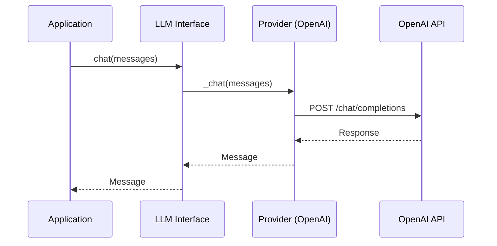
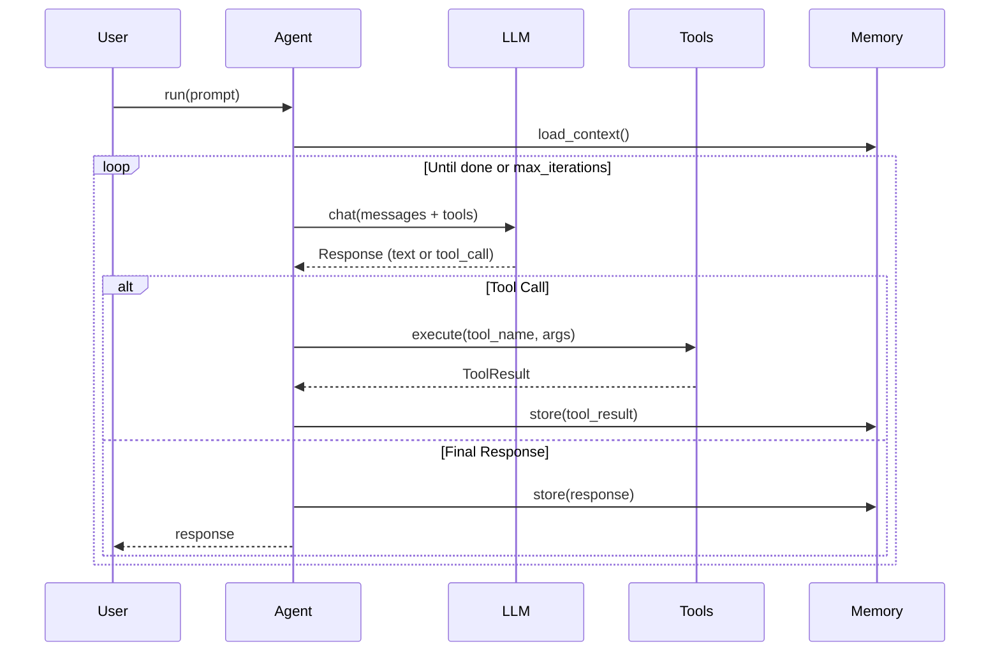
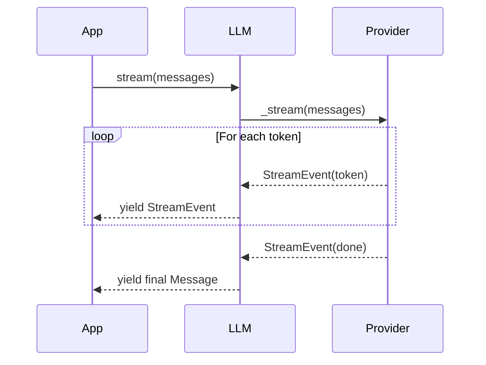

# Architecture Overview

ai-infra provides a modular architecture for building AI/LLM-powered applications. The design separates concerns into distinct layers, enabling provider independence, extensibility, and testability.

## System Architecture

```
┌─────────────────────────────────────────────────────────────────────┐
│                        Application Layer                            │
│  (Your AI logic, chatbots, agents, automation workflows)            │
├─────────────────────────────────────────────────────────────────────┤
│                         Agent Layer                                 │
│    Agent  │  ToolAgent  │  ReActAgent  │  DeepAgent (multi-agent)  │
├─────────────────────────────────────────────────────────────────────┤
│         LLM Interface         │         Tool System                 │
│  Chat │ Stream │ Structured   │  Tool │ ToolResult │ MCP Client    │
├─────────────────────────────────────────────────────────────────────┤
│                        Provider Layer                               │
│  OpenAI │ Anthropic │ Google │ Azure │ Groq │ Together │ Ollama    │
├─────────────────────────────────────────────────────────────────────┤
│                        Infrastructure                               │
│     Retriever (RAG)    │    Graph (Workflows)    │    MCP Server   │
└─────────────────────────────────────────────────────────────────────┘
```

## Module Hierarchy

### Core LLM (`ai_infra.llm`)

The foundation for all LLM interactions:

| Class | Purpose |
|-------|---------|
| `LLM` | Unified interface to all providers |
| `Message` | Chat message with role and content |
| `StreamEvent` | Token events for streaming responses |
| `StructuredOutput` | Pydantic model extraction |

### Providers (`ai_infra.llm.providers`)

Provider-specific implementations:

- **OpenAI** - GPT-4, GPT-3.5, embeddings
- **Anthropic** - Claude 3.5, Claude 3
- **Google** - Gemini Pro, Gemini Ultra
- **Azure** - Azure OpenAI Service
- **Groq** - Fast inference (Llama, Mixtral)
- **Together** - Open source models
- **Ollama** - Local model inference

### Agents (`ai_infra.agents`)

Autonomous AI agents with tool capabilities:

- **Agent** - Base agent with tool calling
- **ToolAgent** - Agent with registered tools
- **ReActAgent** - Reasoning + Acting pattern
- **DeepAgent** - Multi-agent orchestration

### Tools (`ai_infra.tools`)

Function calling infrastructure:

| Component | Purpose |
|-----------|---------|
| `Tool` | Decorated Python function as LLM tool |
| `ToolResult` | Structured result from tool execution |
| `ToolRegistry` | Collection of available tools |

### MCP (`ai_infra.mcp`)

Model Context Protocol implementation:

- **MCPServer** - Host tools over stdio/SSE
- **MCPClient** - Connect to external MCP servers
- **MCPTool** - Tool exposed via MCP

### Retriever (`ai_infra.retriever`)

Retrieval-Augmented Generation (RAG):

- **Retriever** - Semantic search over documents
- **Document** - Text chunk with metadata
- **EmbeddingProvider** - Vector embeddings

### Graph (`ai_infra.graph`)

Workflow orchestration:

- **Graph** - DAG of processing nodes
- **Node** - Single processing step
- **Edge** - Connection with conditions

---

## Message Flow

### Simple Chat Flow



### Agent Execution Flow



### Streaming Flow



---

## Provider Abstraction Layer

### Provider Interface

All providers implement a common interface:

```python
class BaseProvider(ABC):
    @abstractmethod
    async def chat(
        self,
        messages: list[Message],
        model: str | None = None,
        temperature: float = 0.7,
        max_tokens: int | None = None,
        tools: list[Tool] | None = None,
        **kwargs,
    ) -> Message: ...

    @abstractmethod
    async def stream(
        self,
        messages: list[Message],
        **kwargs,
    ) -> AsyncIterator[StreamEvent]: ...
```

### Provider Selection

```python
from ai_infra import LLM

# Auto-detect from available API keys
llm = LLM()  # Uses first available provider

# Explicit provider selection
llm = LLM(provider="anthropic", model="claude-3-5-sonnet-20241022")

# Provider with custom config
llm = LLM(
    provider="openai",
    model="gpt-4-turbo",
    temperature=0.0,
    timeout=60.0,
)
```

### Model Aliasing

Common model names are aliased across providers:

| Alias | OpenAI | Anthropic | Google |
|-------|--------|-----------|--------|
| `"best"` | gpt-4-turbo | claude-3-5-sonnet | gemini-1.5-pro |
| `"fast"` | gpt-3.5-turbo | claude-3-haiku | gemini-1.5-flash |
| `"cheap"` | gpt-3.5-turbo | claude-3-haiku | gemini-1.5-flash |

---

## Key Design Principles

### 1. Provider Agnostic

Write once, run on any provider:

```python
# Same code works with any provider
llm = LLM(provider=os.getenv("LLM_PROVIDER", "openai"))
response = await llm.chat([Message(role="user", content="Hello")])
```

### 2. Streaming First

All operations support streaming:

```python
async for event in llm.stream(messages):
    if event.type == "token":
        print(event.token, end="", flush=True)
```

### 3. Type Safe

Full typing with Pydantic models:

```python
class WeatherResponse(BaseModel):
    temperature: float
    conditions: str

response = await llm.structured(messages, WeatherResponse)
# response is typed as WeatherResponse
```

### 4. Tool Integration

First-class tool support:

```python
@tool
def get_weather(city: str) -> str:
    """Get current weather for a city."""
    return f"Sunny, 72F in {city}"

agent = Agent(tools=[get_weather])
response = await agent.run("What's the weather in NYC?")
```

---

## Integration Points

### With svc-infra

```python
from ai_infra import Agent
from svc_infra import create_app, router

app = create_app()

@router.post("/chat")
async def chat(request: ChatRequest):
    agent = Agent()
    return await agent.run(request.message)
```

### With robo-infra

```python
from ai_infra import Agent, tool
from robo_infra.controllers import DifferentialDrive

rover = DifferentialDrive(...)

@tool
def move_robot(direction: str, speed: float):
    """Move the robot in a direction."""
    if direction == "forward":
        rover.forward(speed)
    # ...

agent = Agent(tools=[move_robot])
await agent.run("Move forward slowly")
```

### With fin-infra

```python
from ai_infra import Agent, tool
from fin_infra import get_market_data

@tool
def get_stock_price(symbol: str) -> float:
    """Get current stock price."""
    quote = get_market_data().get_quote(symbol)
    return quote.price

agent = Agent(tools=[get_stock_price])
await agent.run("What's Apple's stock price?")
```
