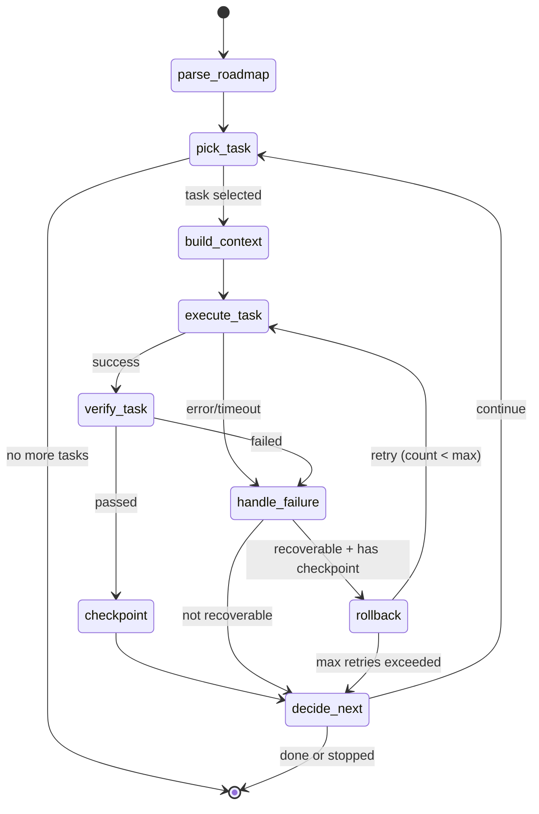

# Executor Graph Architecture

> Phase 1.1: Design documentation for graph-based executor using `ai_infra.graph.Graph`.

## Overview

The executor migrates from an imperative while-loop to a graph-based state machine, enabling:
- LangGraph Studio visualization
- Human-in-the-loop (HITL) workflows
- Checkpoint-based recovery
- Replay from any point
- Streaming state updates

**Important**: All implementations use `ai_infra.graph.Graph`, not direct LangGraph imports.

## State Schema

### ExecutorGraphState

```python
from typing import TypedDict

class ExecutorGraphState(TypedDict, total=False):
    # Input Configuration
    roadmap_path: str           # Path to ROADMAP.md
    max_retries: int            # Max retries per task (default: 3)
    max_tasks: int              # Max tasks to execute (0 = unlimited)

    # Task Tracking
    todos: list[TodoItem]       # All parsed todos
    current_task: TodoItem | None  # Currently executing task
    completed_todos: list[str]  # IDs of completed tasks
    failed_todos: list[str]     # IDs of permanently failed tasks
    tasks_completed_count: int  # Total completed this run

    # Execution Context
    run_memory: dict[str, Any]  # Run context for continuity
    context: str                # Built context for current task
    prompt: str                 # Final prompt to agent
    agent_result: dict | None   # Result from agent execution
    files_modified: list[str]   # Files modified by current task

    # Error Handling
    error: ExecutorError | None # Current error state
    retry_count: int            # Retry attempts for current task

    # Control Flow
    should_continue: bool       # Continue to next task?
    interrupt_requested: bool   # HITL pause flag
    verified: bool              # Task passed verification?

    # Checkpointing
    last_checkpoint_sha: str | None  # Git SHA for rollback
    thread_id: str | None       # Graph thread ID for resume
```

### ExecutorError

```python
class ExecutorError(TypedDict, total=False):
    error_type: Literal["execution", "verification", "timeout", "rollback", "parse", "context"]
    message: str                # Human-readable error
    node: str                   # Which node failed
    task_id: str | None         # Which task failed
    recoverable: bool           # Can retry?
    stack_trace: str | None     # For debugging
```

## Graph Nodes

### Node Definitions

| Node | Purpose | Input State | Output State | Timeout |
|------|---------|-------------|--------------|---------|
| `parse_roadmap` | Parse ROADMAP.md to todos | `roadmap_path` | `todos` | 30s |
| `pick_task` | Select next incomplete task | `todos`, `completed_todos` | `current_task` | 5s |
| `build_context` | Build execution context | `current_task`, `run_memory` | `context`, `prompt` | 60s |
| `execute_task` | Run agent on task | `prompt` | `agent_result`, `files_modified` | 300s |
| `verify_task` | Verify task completion | `files_modified` | `verified`, `error` | 120s |
| `checkpoint` | Git commit + sync ROADMAP | `verified=True` | `last_checkpoint_sha` | 30s |
| `rollback` | Revert to last checkpoint | `last_checkpoint_sha` | `rollback_complete` | 30s |
| `handle_failure` | Process failure, increment retry | `error` | `retry_count`, `recoverable` | 5s |
| `decide_next` | Determine if should continue | state | `should_continue` | 5s |

### Node Signatures

```python
from ai_infra.executor.state import ExecutorGraphState

def parse_roadmap_node(state: ExecutorGraphState) -> ExecutorGraphState:
    """Parse ROADMAP.md and populate todos list."""
    ...

def pick_task_node(state: ExecutorGraphState) -> ExecutorGraphState:
    """Select next incomplete task from todos."""
    ...

def build_context_node(state: ExecutorGraphState) -> ExecutorGraphState:
    """Build context and prompt for current task."""
    ...

def execute_task_node(state: ExecutorGraphState) -> ExecutorGraphState:
    """Execute agent with timeout wrapper."""
    ...

def verify_task_node(state: ExecutorGraphState) -> ExecutorGraphState:
    """Run TaskVerifier on modified files."""
    ...

def checkpoint_node(state: ExecutorGraphState) -> ExecutorGraphState:
    """Create git checkpoint and sync ROADMAP."""
    ...

def rollback_node(state: ExecutorGraphState) -> ExecutorGraphState:
    """Revert files to last checkpoint SHA."""
    ...

def handle_failure_node(state: ExecutorGraphState) -> ExecutorGraphState:
    """Increment retry count, determine if recoverable."""
    ...

def decide_next_node(state: ExecutorGraphState) -> ExecutorGraphState:
    """Check if should continue to next task."""
    ...
```

## Edge Routing

### Conditional Edge Functions

```python
from ai_infra.graph import END

def route_after_pick(state: ExecutorGraphState) -> str:
    """Route after pick_task: context if task selected, else END."""
    if state.get("current_task") is None:
        return END
    return "build_context"

def route_after_execute(state: ExecutorGraphState) -> str:
    """Route after execute: verify if success, else failure."""
    if state.get("error") is not None:
        return "handle_failure"
    return "verify_task"

def route_after_verify(state: ExecutorGraphState) -> str:
    """Route after verify: checkpoint if passed, else failure."""
    if state.get("verified", False):
        return "checkpoint"
    return "handle_failure"

def route_after_failure(state: ExecutorGraphState) -> str:
    """Route after failure: rollback if recoverable and has changes, else decide."""
    error = state.get("error")
    if error and error.get("recoverable", False):
        if state.get("last_checkpoint_sha"):
            return "rollback"
    return "decide_next"

def route_after_rollback(state: ExecutorGraphState) -> str:
    """Route after rollback: retry if under limit, else decide."""
    retry_count = state.get("retry_count", 0)
    max_retries = state.get("max_retries", 3)
    if retry_count < max_retries:
        return "execute_task"
    return "decide_next"

def route_after_decide(state: ExecutorGraphState) -> str:
    """Route after decide: pick next if continuing, else END."""
    if state.get("should_continue", False):
        return "pick_task"
    return END
```

### Complete Graph Wiring

```python
from ai_infra.graph import Graph, START, END
from ai_infra.executor.state import ExecutorGraphState

graph = Graph(
    state_schema=ExecutorGraphState,
    nodes={
        "parse_roadmap": parse_roadmap_node,
        "pick_task": pick_task_node,
        "build_context": build_context_node,
        "execute_task": execute_task_node,
        "verify_task": verify_task_node,
        "checkpoint": checkpoint_node,
        "rollback": rollback_node,
        "handle_failure": handle_failure_node,
        "decide_next": decide_next_node,
    },
    edges=[
        (START, "parse_roadmap"),
        ("parse_roadmap", "pick_task"),
        ("pick_task", route_after_pick),
        ("build_context", "execute_task"),
        ("execute_task", route_after_execute),
        ("verify_task", route_after_verify),
        ("checkpoint", "decide_next"),
        ("handle_failure", route_after_failure),
        ("rollback", route_after_rollback),
        ("decide_next", route_after_decide),
    ],
)
```

## State Flow Diagram



## Timeout Strategy

| Node | Timeout | Rationale |
|------|---------|-----------|
| `parse_roadmap` | 30s | File I/O, should be fast |
| `pick_task` | 5s | In-memory operation |
| `build_context` | 60s | May scan large codebase |
| `execute_task` | 300s | LLM calls + tool execution |
| `verify_task` | 120s | May run tests |
| `checkpoint` | 30s | Git operations |
| `rollback` | 30s | Git operations |
| `handle_failure` | 5s | In-memory operation |
| `decide_next` | 5s | In-memory operation |

All nodes wrapped with `asyncio.wait_for(node(), timeout=NodeTimeouts.X)`.

## Retry Policy

- **Max retries**: 3 (configurable via `ExecutorConfig.retry_failed`)
- **Backoff**: Exponential (1s, 2s, 4s)
- **Jitter**: ±10% to avoid thundering herd

### Non-Retryable Errors

Fail immediately on:
- Authentication failures
- Invalid ROADMAP format
- Git conflicts requiring human resolution
- Permission denied
- Rate limit exceeded

## Execution Model

1. **Sequential**: One task at a time (avoids file conflicts)
2. **Async within nodes**: `Agent.arun()` is async
3. **Cancellation**: Via `interrupt_requested` flag
4. **No parallel tasks**: By design for deterministic execution

## Checkpointing Strategy

### Dual Checkpointing

| Type | Location | Trigger | Purpose |
|------|----------|---------|---------|
| Git | Working directory | `checkpoint_node` | Code versioning |
| Graph | `.executor/graph_state.json` | After each node | Workflow replay |

### Checkpoint Triggers

- `checkpoint_node`: Git commit + graph state + ROADMAP sync
- `handle_failure_node`: Graph state only (preserve error)
- `decide_next_node`: Graph state (loop boundary)

### Resume Flow

```bash
# Resume from thread ID
ai-infra executor resume --thread-id abc123

# Resume with approval (after HITL interrupt)
ai-infra executor resume --thread-id abc123 --approve
```

## HITL Implementation

### Interrupt Points

```python
graph = Graph(
    ...,
    interrupt_before=["execute_task"],  # Approve before execution
    interrupt_after=["verify_task"],     # Review results
)
```

### Resume CLI

```bash
# Approve and continue
ai-infra executor resume --thread-id <id> --approve

# Reject and skip task
ai-infra executor resume --thread-id <id> --reject

# View current state
ai-infra executor status --thread-id <id>
```

## Integration Points

### Existing Components (Unchanged)

| Component | Location | Usage in Graph |
|-----------|----------|----------------|
| `Checkpointer` | `checkpoint.py` | Called in `checkpoint_node` |
| `TodoListManager` | `todolist.py` | Called in `parse_roadmap_node`, `pick_task_node` |
| `TaskVerifier` | `verifier.py` | Called in `verify_task_node` |
| `ProjectContext` | `context.py` | Called in `build_context_node` |
| `RunMemory` | `run_memory.py` | Stored in `state["run_memory"]` |

### Memory Persistence

| Layer | In-Graph | Persistence |
|-------|----------|-------------|
| RunMemory | `state["run_memory"]` | Per-run, in graph state |
| ProjectMemory | No | `.executor/project_memory.json` |
| LearningStore | No | `.executor/learning_store.json` |

## Module Structure

```
src/ai_infra/executor/
├── __init__.py              # Public API
├── graph.py                 # ExecutorGraph class
├── nodes/                   # Node implementations
│   ├── __init__.py
│   ├── parse.py             # parse_roadmap_node
│   ├── pick.py              # pick_task_node
│   ├── context.py           # build_context_node
│   ├── execute.py           # execute_task_node
│   ├── verify.py            # verify_task_node
│   ├── checkpoint.py        # checkpoint_node
│   ├── rollback.py          # rollback_node
│   ├── failure.py           # handle_failure_node
│   └── decide.py            # decide_next_node
├── edges/                   # Edge routing
│   ├── __init__.py
│   └── routes.py            # All route_after_* functions
├── state.py                 # ExecutorGraphState, ExecutorError
├── loop.py                  # Legacy loop (--legacy-mode)
└── ...                      # Existing modules (unchanged)
```

## Usage Example

```python
from ai_infra.executor import ExecutorGraph
from ai_infra.executor.state import ExecutorGraphState

# Initialize graph
graph = ExecutorGraph(
    config=ExecutorConfig(
        model="claude-sonnet-4-20250514",
        max_tasks=10,
        retry_failed=3,
    ),
    agent=my_agent,
    verifier=my_verifier,
)

# Run with initial state
result = await graph.run({
    "roadmap_path": "/path/to/ROADMAP.md",
    "max_retries": 3,
    "max_tasks": 10,
})

# Resume interrupted run
result = await graph.resume(thread_id="abc123", approve=True)
```
