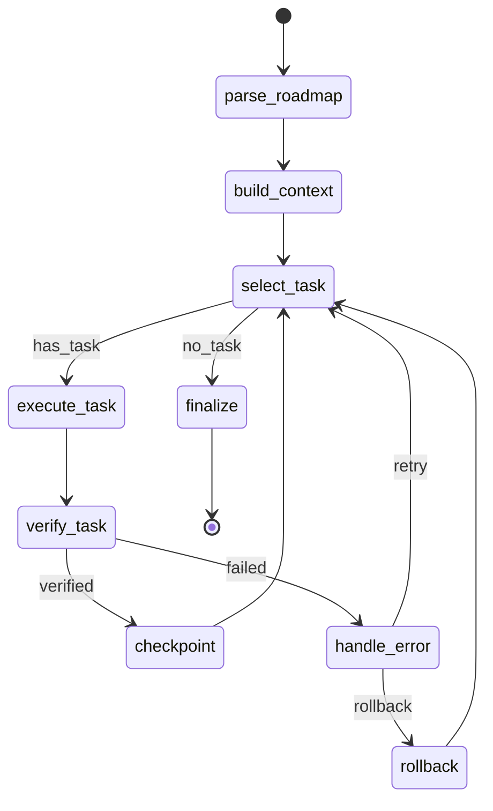

# LangGraph Studio Integration

> Visualize and debug executor graphs using LangGraph Studio and tracing.

## Overview

The graph-based executor integrates with LangGraph Studio for visualization and debugging. This guide covers how to visualize execution flow and debug with tracing.

## Visualization

### Generate Graph Diagram

Use the `--visualize` flag to output a Mermaid diagram:

```bash
ai-infra executor run --roadmap ./ROADMAP.md --visualize
```

Output:


### Render in Mermaid

Paste the diagram into any Mermaid-compatible renderer:
- [Mermaid Live Editor](https://mermaid.live)
- GitHub Markdown (native support)
- VS Code Mermaid extension
- Notion, Confluence, etc.

### Export to File

```bash
ai-infra executor run --roadmap ./ROADMAP.md --visualize > graph.mmd
```

### Programmatic Visualization

```python
from ai_infra.executor.graph import ExecutorGraph
from ai_infra import Agent

agent = Agent(model="claude-sonnet-4-20250514")
executor = ExecutorGraph(agent=agent, roadmap_path="./ROADMAP.md")

# Get Mermaid diagram
mermaid = executor.graph.get_mermaid()
print(mermaid)

# Or get as PNG (requires additional dependencies)
png_bytes = executor.graph.get_mermaid_png()
with open("graph.png", "wb") as f:
    f.write(png_bytes)
```

## Debugging with Tracing

### Configure Tracing

```python
from ai_infra.executor.graph_tracing import TracingConfig, configure_tracing

# Development tracing (verbose, local)
config = TracingConfig.development()

# Production tracing (sampled, remote)
config = TracingConfig.production()

# Custom configuration
config = TracingConfig(
    enabled=True,
    sample_rate=1.0,  # 100% sampling for debugging
    export_to_console=True,
    export_to_otlp=False,
)

configure_tracing(config)
```

### Run with Tracing

```python
from ai_infra.executor.graph import ExecutorGraph
from ai_infra.executor.graph_tracing import TracingConfig

executor = ExecutorGraph(agent=agent, roadmap_path="./ROADMAP.md")

result = await executor.arun_with_tracing(
    tracing_config=TracingConfig.development(),
    run_id="debug-run-001",
)
```

### Trace Output

Tracing captures:

| Event | Data |
|-------|------|
| `node_enter` | Node name, input state, timestamp |
| `node_exit` | Node name, output state, duration |
| `llm_call` | Model, prompt hash, response hash, tokens |
| `tool_call` | Tool name, args, result, duration |
| `error` | Error type, message, stack trace |
| `checkpoint` | Thread ID, state version |

### View Traces

#### Console Output

With `export_to_console=True`:

```
[TRACE] node_enter: parse_roadmap (t=0.0s)
[TRACE] node_exit:  parse_roadmap (duration=1.2s)
[TRACE] node_enter: build_context (t=1.2s)
[TRACE] llm_call:   claude-sonnet-4-20250514 (tokens=1234)
[TRACE] node_exit:  build_context (duration=3.5s)
...
```

#### JSON Export

```python
config = TracingConfig(
    enabled=True,
    export_to_json=True,
    json_path="./traces/run-001.json",
)
```

### Debug Callbacks

Register custom callbacks for real-time debugging:

```python
from ai_infra.executor.graph_callbacks import ExecutorCallbacks

class DebugCallbacks(ExecutorCallbacks):
    def on_node_start(self, node: str, state: dict) -> None:
        print(f">> Entering {node}")
        print(f"   Current task: {state.get('current_task', {}).get('title', 'N/A')}")

    def on_node_end(self, node: str, state: dict, duration: float) -> None:
        print(f"<< Exiting {node} ({duration:.2f}s)")

    def on_error(self, error: dict) -> None:
        print(f"!! Error in {error['node']}: {error['message']}")

executor = ExecutorGraph(
    agent=agent,
    roadmap_path="./ROADMAP.md",
    callbacks=DebugCallbacks(),
)
```

## HITL Debugging

### Set Breakpoints

Use interrupt points to pause execution:

```bash
# Pause before task execution for review
ai-infra executor run --roadmap ./ROADMAP.md --interrupt-before execute_task

# Pause after verification to inspect results
ai-infra executor run --roadmap ./ROADMAP.md --interrupt-after verify_task
```

### Interactive Debugging

When paused, the executor prompts for action:

```
[PAUSED] Before execute_task
Current task: "Implement user authentication"
Context files: src/auth.py, tests/test_auth.py

Actions:
  [c]ontinue  - Resume execution
  [s]kip      - Skip this task
  [a]bort     - Stop execution
  [i]nspect   - View current state

> _
```

### Programmatic HITL

```python
from ai_infra.executor.graph import ExecutorGraph

executor = ExecutorGraph(
    agent=agent,
    roadmap_path="./ROADMAP.md",
    interrupt_before=["execute_task"],
    interrupt_after=["verify_task"],
)

# Run until interrupt
state = await executor.arun_until_interrupt()

# Inspect state
print(f"Task: {state['current_task']['title']}")
print(f"Context: {state['context_files']}")

# Resume
state = await executor.aresume(state)
```

## Checkpointing and Recovery

### View Checkpoint History

```bash
ai-infra executor checkpoints --roadmap ./ROADMAP.md
```

Output:
```
Checkpoints for ./ROADMAP.md:
  [1] 2024-01-15T10:30:00Z - After: Implement user authentication
  [2] 2024-01-15T10:45:00Z - After: Add rate limiting middleware
  [3] 2024-01-15T11:00:00Z - After: Set up database migrations
```

### Restore Checkpoint

```bash
ai-infra executor restore --checkpoint 2 --roadmap ./ROADMAP.md
```

### Programmatic Checkpointing

```python
# Get checkpoint history
checkpoints = await executor.get_checkpoints()
for cp in checkpoints:
    print(f"{cp['id']}: {cp['timestamp']} - {cp['task_title']}")

# Restore specific checkpoint
await executor.restore_checkpoint(checkpoint_id="cp-002")

# Resume from restored state
result = await executor.arun()
```

## Troubleshooting

### Traces Not Appearing

**Check**: Is tracing enabled?

```python
config = TracingConfig(enabled=True)  # Must be True
```

**Check**: Is sample rate > 0?

```python
config = TracingConfig(sample_rate=1.0)  # 1.0 = 100%
```

### Mermaid Diagram Empty

**Check**: Ensure graph is built before visualization:

```python
executor = ExecutorGraph(agent=agent, roadmap_path="./ROADMAP.md")
# Graph is built on initialization
mermaid = executor.graph.get_mermaid()
```

### Interrupt Not Triggering

**Check**: Ensure node name matches exactly:

```bash
# Correct
--interrupt-before execute_task

# Wrong (case sensitive)
--interrupt-before Execute_Task
--interrupt-before EXECUTE_TASK
```

Valid interrupt points:
- `parse_roadmap`
- `build_context`
- `select_task`
- `execute_task`
- `verify_task`
- `checkpoint`
- `handle_error`
- `rollback`
- `finalize`

### High Memory Usage with Tracing

For long-running executions, use sampling:

```python
config = TracingConfig(
    enabled=True,
    sample_rate=0.1,  # Only trace 10% of operations
    max_trace_size_mb=100,  # Limit trace file size
)
```

## Integration with External Tools

### OpenTelemetry Export

```python
config = TracingConfig(
    enabled=True,
    export_to_otlp=True,
    otlp_endpoint="http://localhost:4317",
)
```

### Jaeger Integration

```python
config = TracingConfig(
    enabled=True,
    export_to_otlp=True,
    otlp_endpoint="http://jaeger:4317",
    service_name="ai-infra-executor",
)
```

### Custom Trace Processors

```python
from ai_infra.executor.graph_tracing import TraceProcessor

class CustomProcessor(TraceProcessor):
    def process_span(self, span: dict) -> dict:
        # Add custom metadata
        span["custom_field"] = "value"
        return span

config = TracingConfig(
    enabled=True,
    processors=[CustomProcessor()],
)
```
